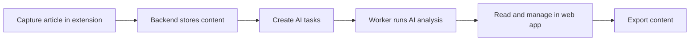

English | [中文](./README.zh-CN.md)

## What is Lumina?

Lumina is an information management workspace that combines a web app, FastAPI backend, and browser extension to help you capture web content, use AI insights, and manage reading efficiently.

## Core Features

- **Browser capture workflow**: one-click full-page or selection capture via popup/context menu, with built-in capture history and error logs.
- **Structured article library**: advanced filtering by category/author/source/time plus batch actions for efficient content management.
- **Deep reading experience**: detail page supports original/translated views, immersive mode, TOC, annotations, and comments.
- **AI insight pipeline**: generate summary, outline, key points, translation, and similar-article recommendations with retryable background tasks.
- **Admin control center**: configure model APIs (general/vector), prompts, recommendation strategy, categories, and site-level settings.
- **Operations and observability**: monitor AI tasks and usage (calls/tokens/cost), comment status, and key backend health signals.
- **Content lifecycle management**: local media storage/compression/cleanup plus JSON backup export/import for migration and recovery.
- **Localized UI and access model**: built-in Chinese/English UI support with guest browsing and admin-authenticated management flows.

## Product Flow



## Screenshots

### 1) Home


### 2) List page


### 3) Article detail page

- **Normal mode (default)**: shows original content, full-text annotations, highlights, TOC, AI insights, and recommendations.


- **Immersive mode**: wide reading mode, hides navigation for focused reading.


### 4) Admin dashboard

- **Monitoring module**: model usage/billing, AI tasks, and comment monitoring.


- **Settings module**: basic, categories, AI, comments, and storage configuration.


### 5) Extension
[Download](https://github.com/shawnxie94/lumina/releases)

- **One-click full-page capture**: capture via extension button or page context menu without selecting text.


- **One-click selection capture**: select text first, then capture via extension button or context menu.


### 6) Other features

- **Theme switch**: supports light/dark mode.


- **Recent reading history**: keeps the latest 5 articles for quick jump.


- **Article comments**: supports commenting on article detail pages for collaboration and feedback.


- **Content export**: export article title, cover image, and summary by category.


More features are coming...

## Quick Start

```bash
docker-compose up -d
./scripts/docker_healthcheck.sh
```

Open:

- Web: <http://localhost:3000>
- API (routes): <http://localhost:8000/backend>
- API (docs): <http://localhost:8000/docs>

## Minimal Dev Notes

```bash
# Frontend
cd frontend
npm install
npm run dev

# Backend
cd backend
uv sync
uv run uvicorn main:app --reload

# Extension
cd extension
npm install
npm run dev
```

## FAQ

### Why does API fail to start?

`INTERNAL_API_TOKEN` is required by backend startup validation. Set it in your environment or Docker config.

### Why can't I log in to the admin panel?

On first run, open `/login` and set the admin password before normal login.

### Why does frontend API return 404 (for example `/api/articles`)?

Backend routes are served under `/backend/api/*` only (unprefixed `/api/*` is not available).

Check `API_BASE_URL`. In same-origin production it should normally be `/backend`; in local split-port setups it can be `http://localhost:8000/backend`.


### Why does the extension fail to submit article?

Check extension API host settings and confirm backend is reachable from the browser.

## License

MIT License
