English | [中文](./README.zh-CN.md)

## What is Lumina?

Lumina is an information management workspace that combines a web app, FastAPI backend, and browser extension to help you capture web content, use AI insights, and manage reading efficiently.

## Core Features

- **One-click full-page or selection capture**: capture page title, content, metadata, and images from the browser extension.
- **AI reading enhancement**: generate summary, outline, key points, translation, and related reading recommendations.
- **Structured article library**: filter by category, author, source, and time, with batch management actions.
- **Immersive reading on detail pages**: switch original/translated content and review AI insight panels.
- **Centralized admin configuration**: manage model APIs, prompts, task monitoring, comments, and categories.
- **Reusable content export**: export organized content for writing and knowledge workflows.

## Product Flow

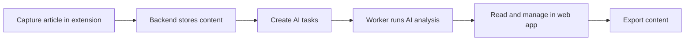

## Screenshots

### 1) Home

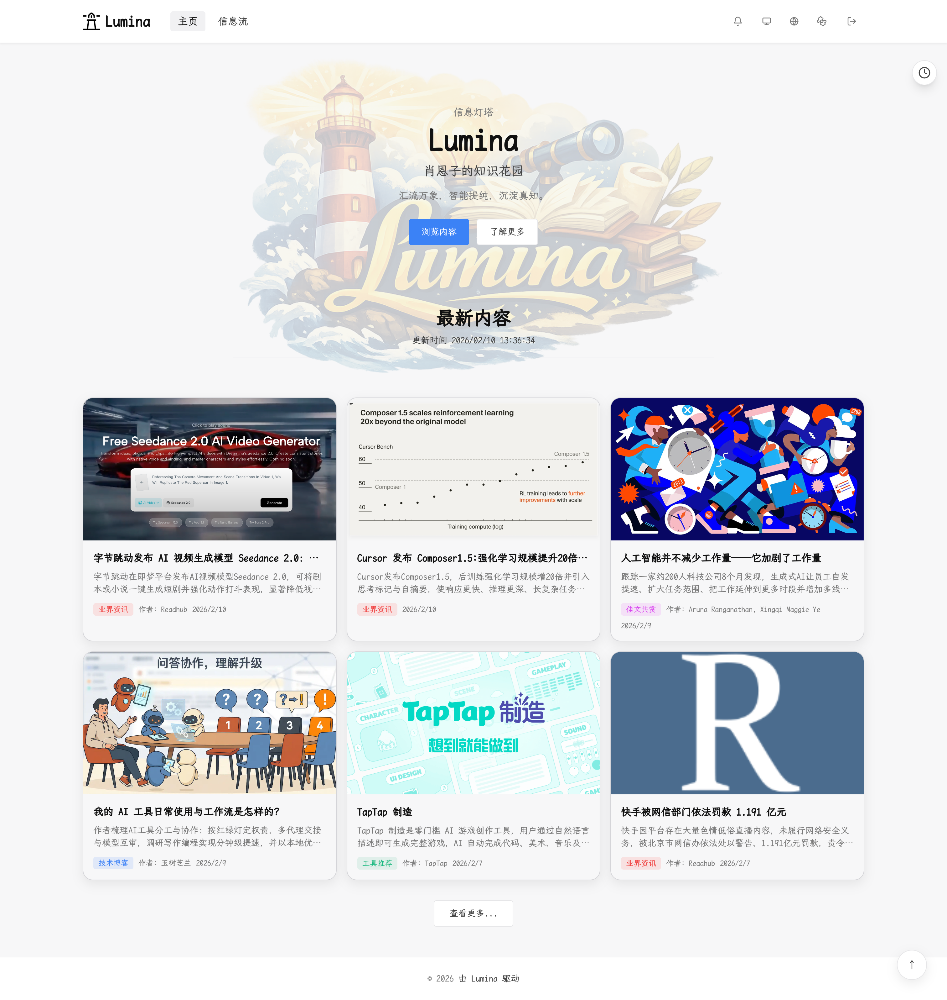

### 2) List page

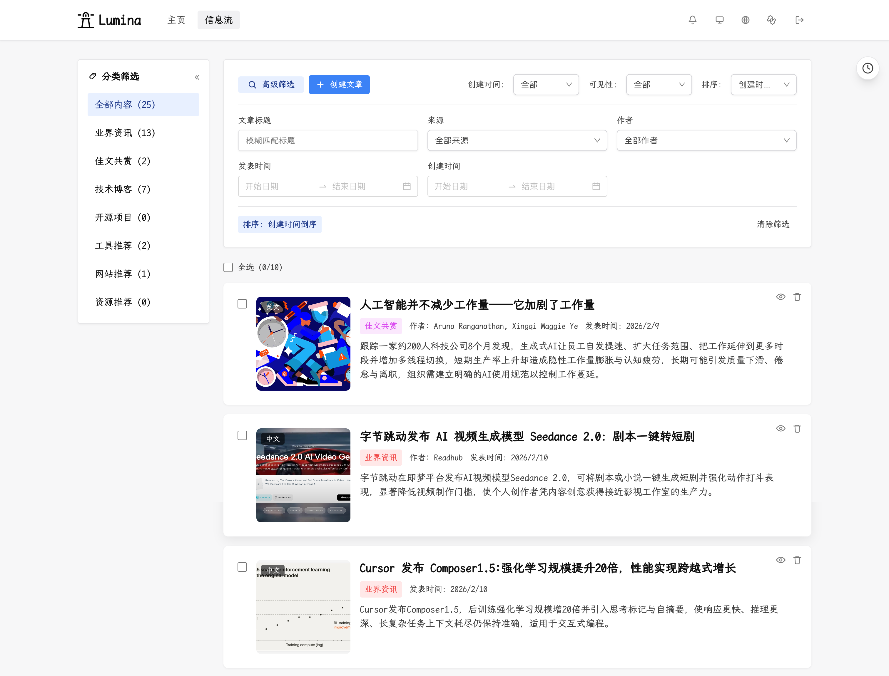

### 3) Article detail page

- **Normal mode (default)**: shows original content, full-text annotations, highlights, TOC, AI insights, and recommendations.

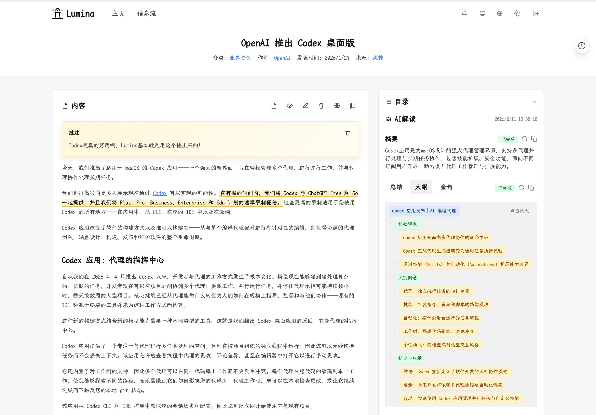

- **Immersive mode**: wide reading mode, hides navigation for focused reading.

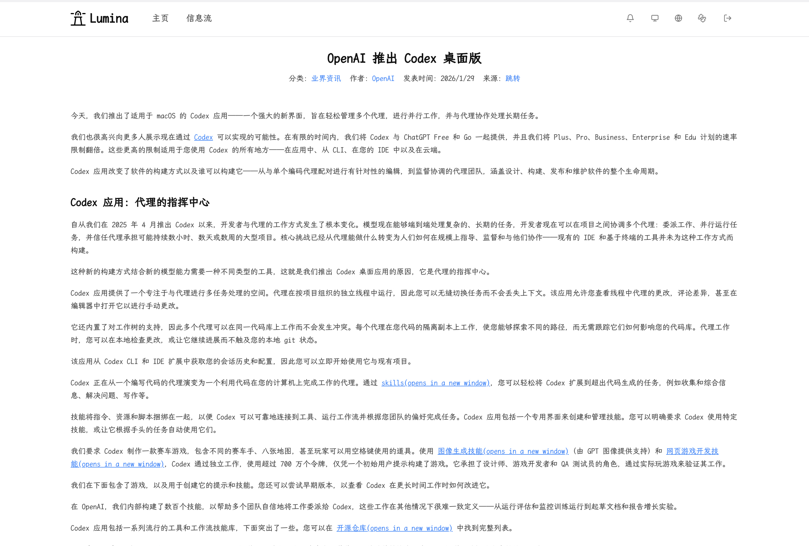

### 4) Admin dashboard

- **Monitoring module**: model usage/billing, AI tasks, and comment monitoring.


- **Settings module**: basic, categories, AI, comments, and storage configuration.

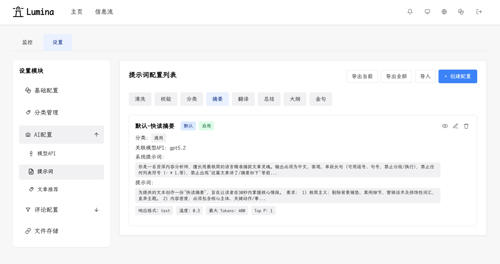

### 5) Extension
[Download](https://github.com/shawnxie94/lumina/releases)

- **One-click full-page capture**: capture via extension button or page context menu without selecting text.

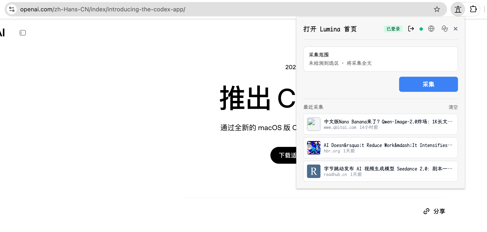

- **One-click selection capture**: select text first, then capture via extension button or context menu.

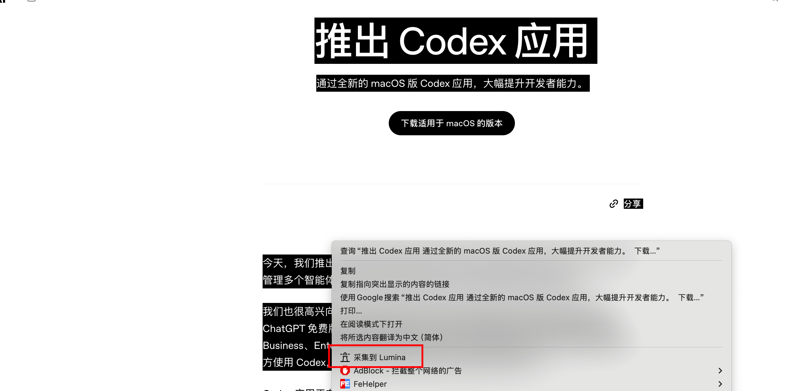

### 6) Other features

- **Theme switch**: supports light/dark mode.

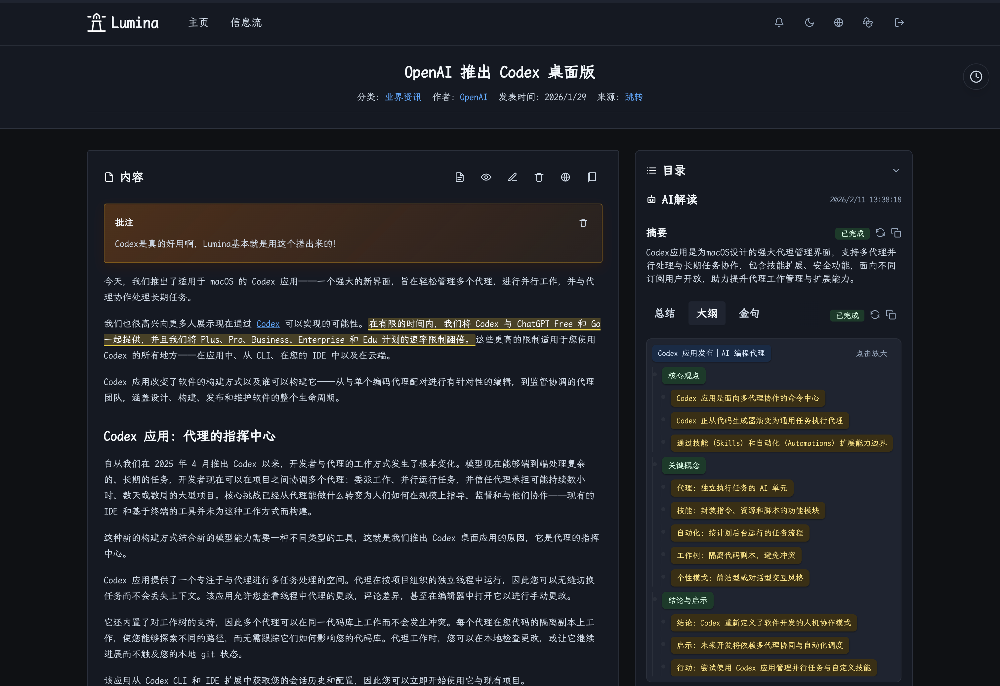

- **Recent reading history**: keeps the latest 5 articles for quick jump.

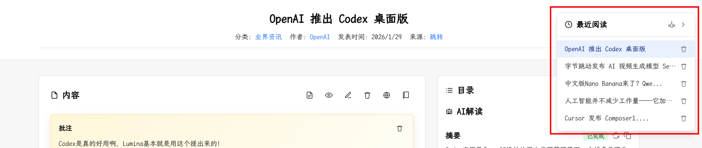

- **Article comments**: supports commenting on article detail pages for collaboration and feedback.

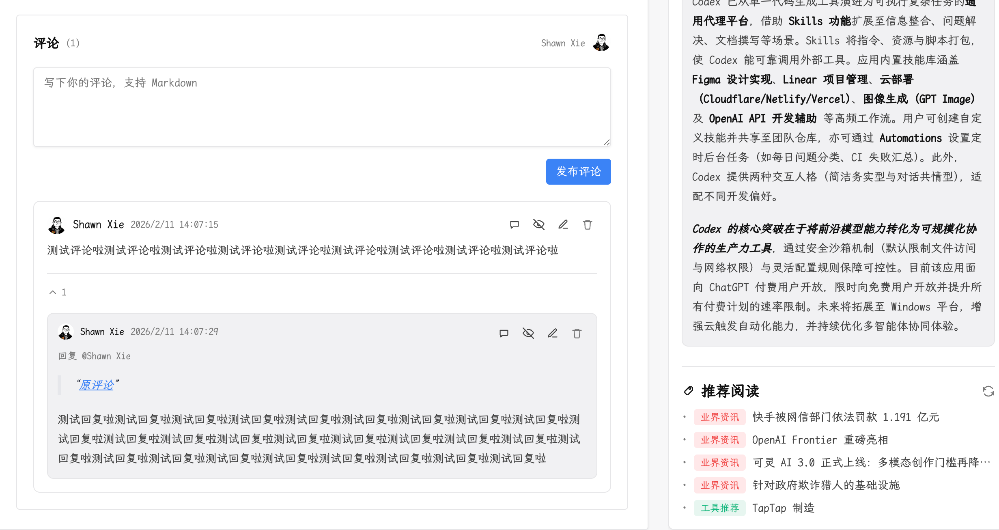

- **Content export**: export article title, cover image, and summary by category.

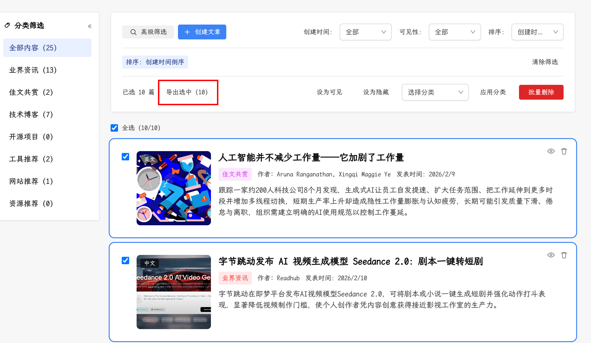

More features are coming...

## Quick Start

```bash
docker-compose up -d
./scripts/docker_healthcheck.sh
```

Open:

- Web: <http://localhost:3000>
- API: <http://localhost:8000>

## Minimal Dev Notes

```bash
# Frontend
cd frontend
npm install
npm run dev

# Backend
cd backend
uv sync
uv run uvicorn main:app --reload

# Extension
cd extension
npm install
npm run dev
```

## FAQ

### Why does API fail to start?

`INTERNAL_API_TOKEN` is required by backend startup validation. Set it in your environment or Docker config.

### Why can't I log in to the admin panel?

On first run, open `/login` and set the admin password before normal login.

### Why does frontend API return 404 (for example `/api/articles`)?

This should not happen in same-origin deployments; for cross-origin setups, check whether `API_BASE_URL` points to a backend URL reachable by the browser.

### Why does the extension fail to submit article?

Check extension API host settings and confirm backend is reachable from the browser.

## License

MIT License
