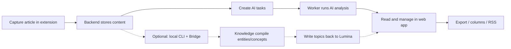

English | [中文](./README.zh-CN.md)

## What is Lumina?

Lumina is an information management workspace that combines a web app, FastAPI backend, and browser extension to help you capture web content, run AI insights, and manage reading efficiently.

## Core Features

- **Browser capture workflow**: one-click full-page or selection capture via popup/context menu, powered by Defuddle, with recent capture history and error logs.
- **Structured article library**: title search plus category / author / source / time filters, optional topic filter when enabled, and batch category, hide, and delete actions.
- **Deep reading experience**: detail page supports original/translated views, immersive mode, TOC, article notes, highlight annotations, topic chips, and rendering for code, math, and common media embeds.
- **AI insight pipeline**: generate summaries, key points, quotes, outlines, translations, auto-classification, and similar-article recommendations with monitorable background tasks that support continuation, repair rounds, cancellation, retry, and chain timelines.
- **Columns workspace**: publish curated columns, insert article / topic / quote-style references in the editor, and organize longer-form reading paths on top of your library.
- **Optional topic knowledge**: enable Topic settings, install Lumina CLI locally, connect Bridge to a knowledge project (default provider: llm_wiki), then sync entity/concept topics back to articles and topic detail pages.
- **Comments and collaboration**: article comments/replies, admin moderation (hide/delete), GitHub/Google OAuth sign-in, and sensitive-word filtering for public discussions.
- **Admin control center**: configure site basics and home copy, model APIs (general/vector), prompts, recommendation strategy, categories, columns-related settings, comments, optional topic/Bridge settings, and storage.
- **Operations and observability**: monitor AI task timelines, usage metrics (calls/tokens/cost), header notification center for failed tasks/API errors, and key backend health signals.
- **Content lifecycle management**: local media storage/compression/cleanup, detail-page Markdown export, public RSS feeds, plus background backup generation/download and strict incremental import for migration and recovery.
- **Localized UI and access model**: built-in Chinese/English UI, light/dark themes, guest browsing, and admin-authenticated management flows.

## Product Flow


```mermaid
flowchart LR
    A["Capture article in extension"] --> B["Backend stores content"]
    B --> C["Create AI tasks"]
    C --> D["Worker runs AI analysis"]
    D --> E["Read and manage in web app"]
    E --> F["Export / columns / RSS"]
    B -.-> G["Optional: local CLI + Bridge"]
    G -.-> H["Knowledge compile entities/concepts"]
    H -.-> I["Write topics back to Lumina"]
    I -.-> E
```

### RSS Reader

Android phone RSS reader can use [readrops-lumina](https://github.com/shawnxie94/readrops-lumina), [download](https://github.com/shawnxie94/readrops-lumina/releases), to quickly collect content to [Lumina](https://github.com/shawnxie94/lumina).


## Screenshots

### 1) Home


### 2) List page


### 3) Article detail page

- **Normal mode (default)**: shows original content, full-text annotations, highlights, TOC, AI insights, topics, and recommendations.


- **Immersive mode**: wide reading mode, hides navigation for focused reading.


### 4) Admin dashboard

- **Monitoring module**: model usage/billing, AI tasks, and comment monitoring.


- **Settings module**: basic, categories, AI, comments, storage, and optional topic parsing settings.


### 5) Extension
[Download](https://github.com/shawnxie94/lumina/releases)

- **One-click full-page capture**: capture via extension button or page context menu without selecting text.


- **One-click selection capture**: select text first, then capture via extension button or context menu.


### 6) Other features

- **Theme switch**: supports light/dark mode.


- **Recent reading history**: keeps the latest 5 articles for quick jump.


- **Article comments**: supports commenting on article detail pages for collaboration and feedback.


- **Content export**: export article title, cover image, and summary by category, and download the current article or column detail page as Markdown.


- **Columns workspace**: published column pages, template-assisted drafting, article/topic/content reference insertion, and column comments.


- **RSS subscription**: public RSS feeds for articles and columns; article feeds support category filters.


- **Notification center**: view AI task-chain failures and API error notifications in the page header.


- **Backup operations**: storage settings can start a “latest backup” background job, poll generation status, and download the archive when ready.


More features are evolving...

## Quick Start

```bash
docker compose up -d
./scripts/docker_healthcheck.sh
```

URLs:

- Web: <http://localhost:3000>
- API: <http://localhost:8000/backend>
- API docs: <http://localhost:8000/docs>

## Production Notes

- The Docker Compose file includes an API healthcheck for `/backend/`.
- `./scripts/docker_watchdog.sh` can run via cron or systemd and restart the API when the probe fails.
- In production, prefer nginx serving `/backend/media/` directly instead of proxying media through FastAPI. See `deploy/nginx/lumina.conf.example`.

## Minimal development notes

```bash
# Frontend
cd frontend
npm install
npm run dev

# Backend
cd backend
uv sync
uv run uvicorn main:app --reload

# Extension
cd extension
npm install
npm run dev
```

## FAQ

### Why does the API fail to start?

Backend startup validation requires `INTERNAL_API_TOKEN`. Set it in env or Docker config.

### Why can’t I log into admin?

On first use, open `/login` to set the admin password, then sign in normally.

### Why do frontend API calls 404 (for example `/api/articles`)?

Backend routes are only served under `/backend/api/*` (bare `/api/*` is not available).

Check `API_BASE_URL`. Same-origin setups usually use `/backend`; split local ports may use `http://localhost:8000/backend`.

### Why can’t the extension submit articles?

Check the extension API base URL and confirm the browser can reach the backend.

### Why are topics empty?

Topic parsing is optional and off by default. Enable it in admin **Topic parsing** settings, install/run local CLI + Bridge + knowledge compiler, then sync. Public topic pages only show compiled **entities** and **concepts** for now.

## License

MIT License
