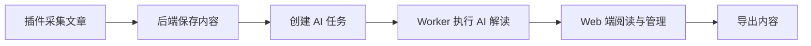

[English](./README.md) | 中文

## Lumina 是什么？

Lumina 是一个信息管理工作台，通过 Web 应用 + FastAPI 后端 + 浏览器扩展，帮助你完成网页采集、AI 解读与阅读管理。

## 核心功能

- **网页全文/选区一键采集**：通过浏览器扩展抓取当前页面的标题、正文、元信息与图片。
- **AI 阅读增强**：生成摘要、大纲、要点、翻译和相关文章推荐。
- **结构化文章库管理**：按分类、作者、来源、时间筛选，并支持批量管理。
- **沉浸式详情阅读**：在详情页切换原文/译文，同时查看 AI 解读面板。
- **后台集中配置**：管理模型 API、提示词、任务监控、评论与分类配置。
- **内容导出复用**：将文章内容整理后导出，方便二次创作和知识归档。

## 产品使用流程



## 页面截图
### 1) 主页


### 2) 列表页


### 3) 文章详情页
- **普通模式（默认）**：显示原文、全文批注、划线批注、目录、AI 解读和推荐阅读等。


- **沉浸模式**：宽屏模式，隐藏导航栏，专注于文章内容。


### 4) 管理后台

- **监控模块**：支持模型调用记录/计费、AI任务和评论数据监控。


- **设置模块**：支持基础、分类、AI、评论和文件存储等配置。


### 5) 扩展插件

- **全文一键采集**：不选中内容，点击插件采集按钮或页面右键采集。


- **选区一键采集**：选中内容后，点击插件采集按钮或页面右键采集。


### 6) 其他功能
- **主题切换**：支持明亮/暗黑模式。


- **最近阅读记录**：显示最近阅读的5篇内容，方便快速跳转。


- **文章评论**：支持在详情页对文章进行评论，方便交流与反馈。


- **内容导出**：支持按分类导出文章标题、头图和摘要。


更多功能迭代中...

## 快速开始

```bash
docker-compose up -d
./scripts/docker_healthcheck.sh
```

访问地址：

- Web：<http://localhost:3000>
- API：<http://localhost:8000>

## 最小开发说明

```bash
# Frontend
cd frontend
npm install
npm run dev

# Backend
cd backend
uv sync
uv run uvicorn main:app --reload

# Extension
cd extension
npm install
npm run dev
```

## 常见问题

### API 为什么启动失败？

后端启动校验要求 `INTERNAL_API_TOKEN` 必填，请在环境变量或 Docker 配置中设置。

### 为什么无法登录后台？

首次使用需要先访问 `/login` 设置管理员密码，之后再正常登录。

### 扩展为什么无法提交文章？

请检查扩展中的 API 地址与 token 配置，并确认浏览器可以访问后端接口。

### README 里的截图为什么不显示？

请检查 `./docs/assets/screenshots/` 下的文件名与路径是否正确，并确认图片已提交到仓库。

## 许可证

MIT License
