[English](./README.md) | 中文

## Lumina 是什么？

Lumina 是一个信息管理与阅读工作台，由 Web 应用、FastAPI 后端和浏览器扩展组成，用于采集网页内容、做 AI 解读，并高效管理阅读。

## 核心能力

- **浏览器采集**：弹窗/右键一键全文或选区采集，基于 Defuddle，带最近采集历史与错误日志。
- **结构化文章库**：标题搜索，以及分类 / 作者 / 来源 / 时间筛选；开启主题后支持主题筛选；支持批量改分类、隐藏、删除。
- **深度阅读**：详情页支持原文/译文、沉浸模式、目录、笔记、划线批注、主题标签，以及代码、公式与常见媒体嵌入渲染。
- **AI 解读流水线**：摘要、要点、金句、大纲、翻译、自动分类、相似推荐等；后台任务可监控，支持续跑、修复轮、取消、重试与任务链时间线。
- **专栏工作台**：发布专栏内容，在编辑器中插入文章 / 主题 / 引用类内容，在文章库之上组织更长的阅读路径。
- **可选主题知识**：在设置中开启主题解析，本机安装 Lumina CLI，连接 Bridge 与知识库项目（默认 llm_wiki），将实体/概念同步回文章与主题详情页。
- **评论与协作**：文章评论/回复、管理员隐藏/删除、GitHub/Google OAuth 登录，以及敏感词过滤。
- **管理后台**：站点基础与首页文案、模型 API（通用/向量）、提示词、推荐策略、分类、专栏相关配置、评论、可选主题/Bridge 设置，以及存储配置。
- **运维与可观测**：AI 任务时间线、用量指标（调用/Token/费用）、页头通知中心（任务失败/接口错误），以及关键后端健康信号。
- **内容生命周期**：本地媒体存储/压缩/清理，详情页 Markdown 导出，公开 RSS，以及后台备份生成/下载与严格增量导入恢复。
- **多语言与权限**：内置中英文界面、明暗主题，支持访客浏览与管理员鉴权管理。

## 使用流程

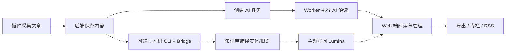
```mermaid
flowchart LR
    A["插件采集文章"] --> B["后端保存内容"]
    B --> C["创建 AI 任务"]
    C --> D["Worker 执行 AI 解读"]
    D --> E["Web 端阅读与管理"]
    E --> F["导出 / 专栏 / RSS"]
    B -.-> G["可选：本机 CLI + Bridge"]
    G -.-> H["知识库编译实体/概念"]
    H -.-> I["主题写回 Lumina"]
    I -.-> E
```

### RSS 阅读

Android 手机端 RSS 阅读可使用 [readrops-lumina](https://github.com/shawnxie94/readrops-lumina)，[安装包](https://github.com/shawnxie94/readrops-lumina/releases)，支持快速采集内容到 [Lumina](https://github.com/shawnxie94/lumina)。


## 页面截图

### 1) 主页

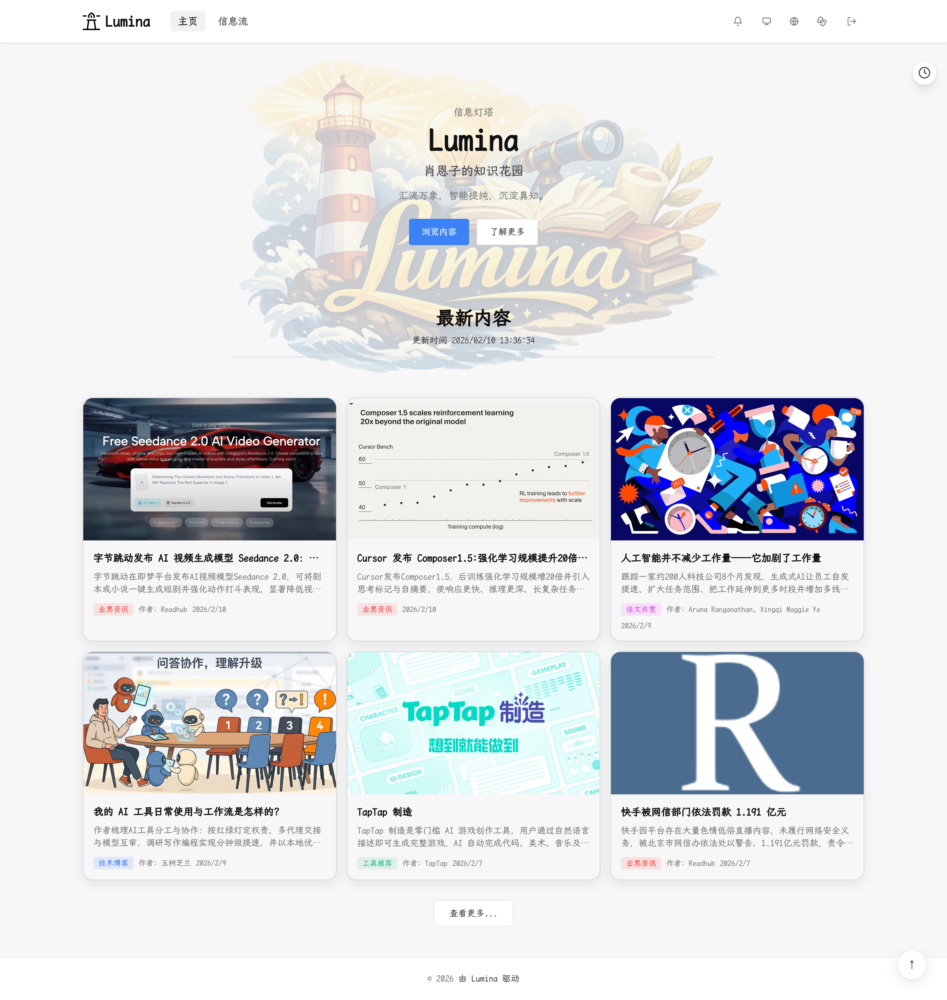

### 2) 列表页

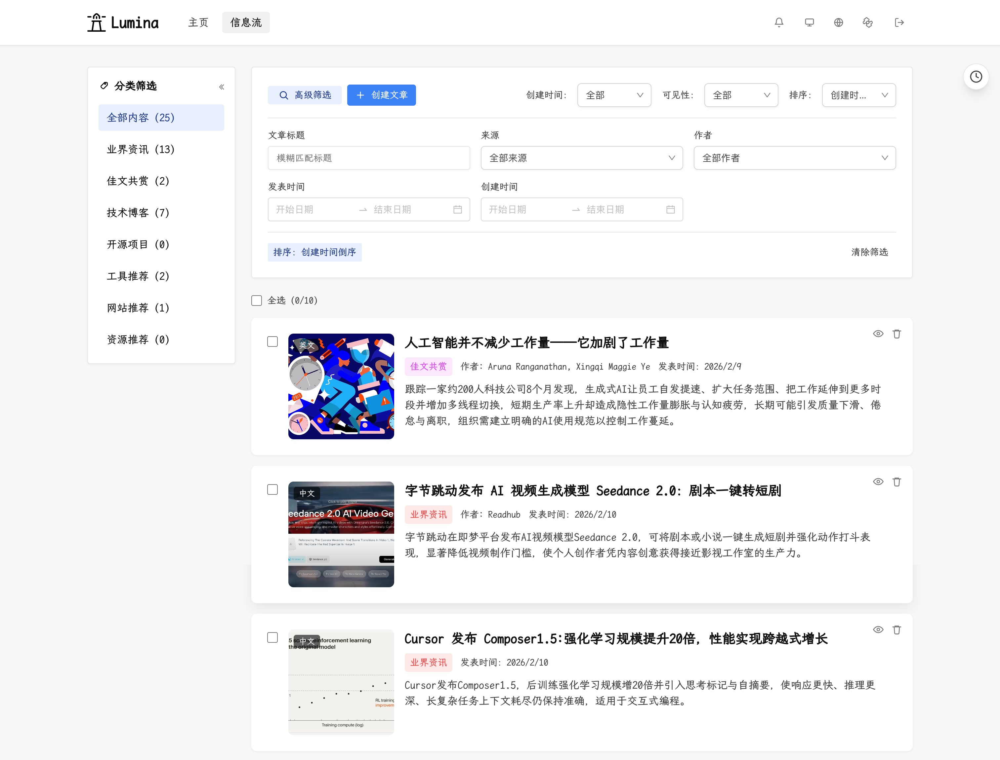

### 3) 文章详情页

- **普通模式（默认）**：显示原文、全文批注、划线批注、目录、AI 解读、主题与推荐阅读等。

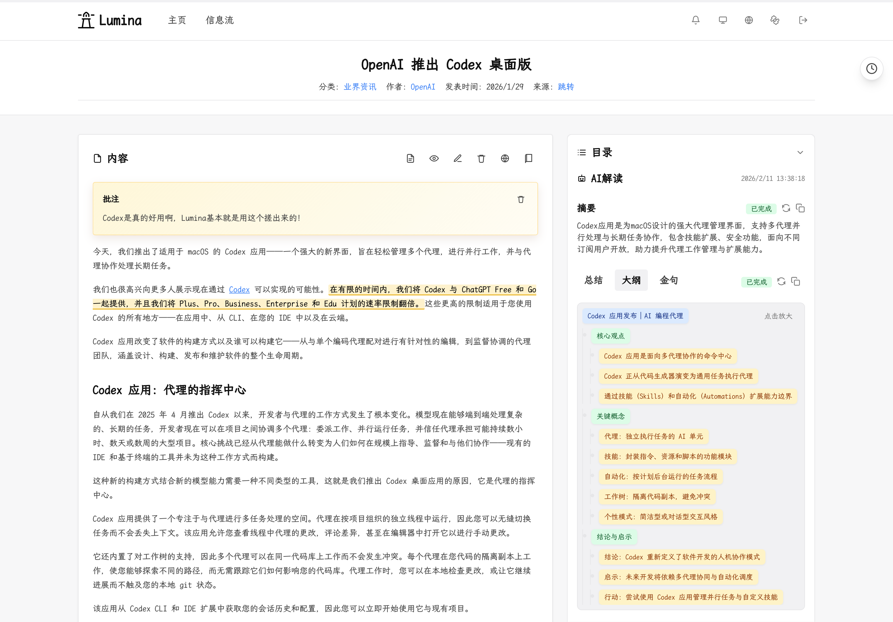

- **沉浸模式**：宽屏模式，隐藏导航栏，专注于文章内容。

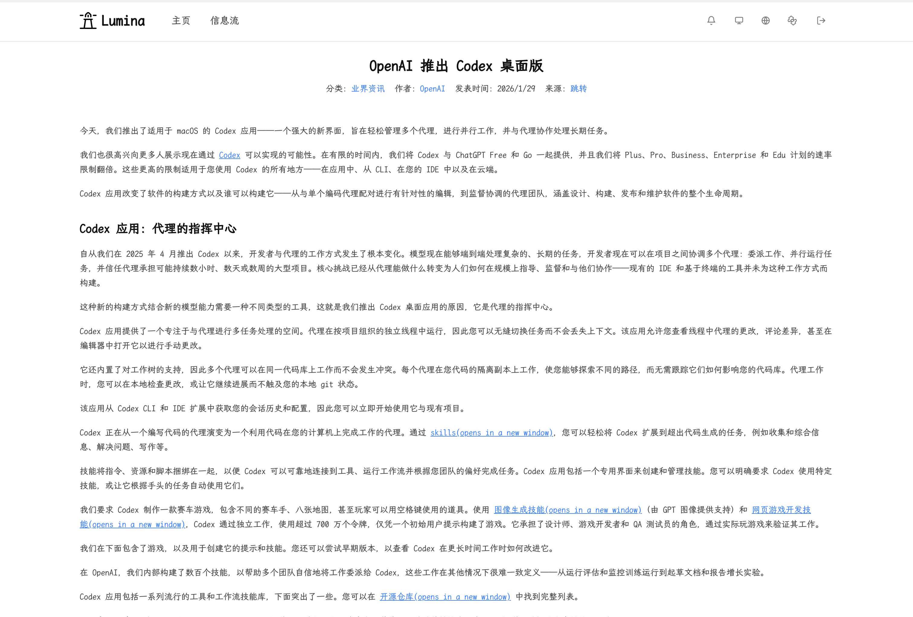

### 4) 管理后台

- **监控模块**：支持模型调用记录/计费、AI 任务和评论数据监控。

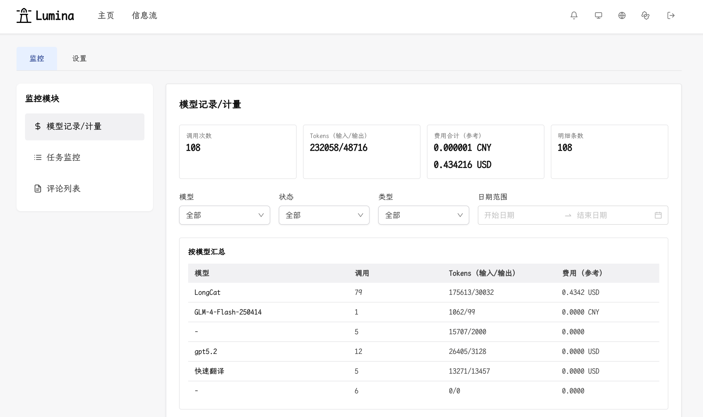

- **设置模块**：支持基础、分类、AI、评论、文件存储，以及可选的主题解析配置。

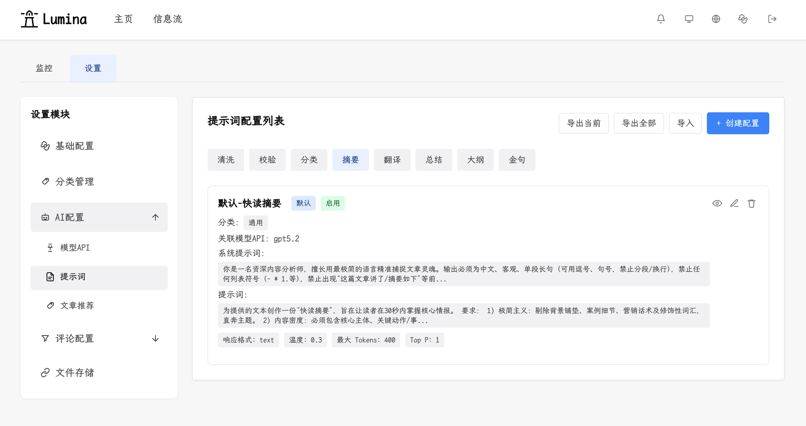

### 5) 扩展插件
[下载地址](https://github.com/shawnxie94/lumina/releases)

- **全文一键采集**：不选中内容，点击插件采集按钮或页面右键采集。

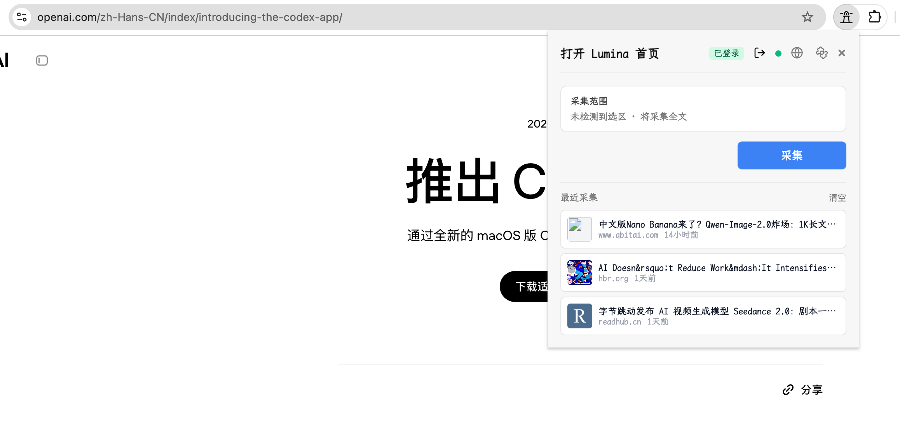

- **选区一键采集**：选中内容后，点击插件采集按钮或页面右键采集。

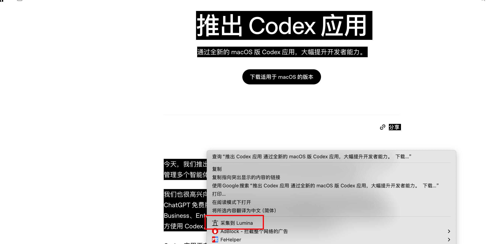

### 6) 其他功能

- **主题切换**：支持明亮/暗黑模式。

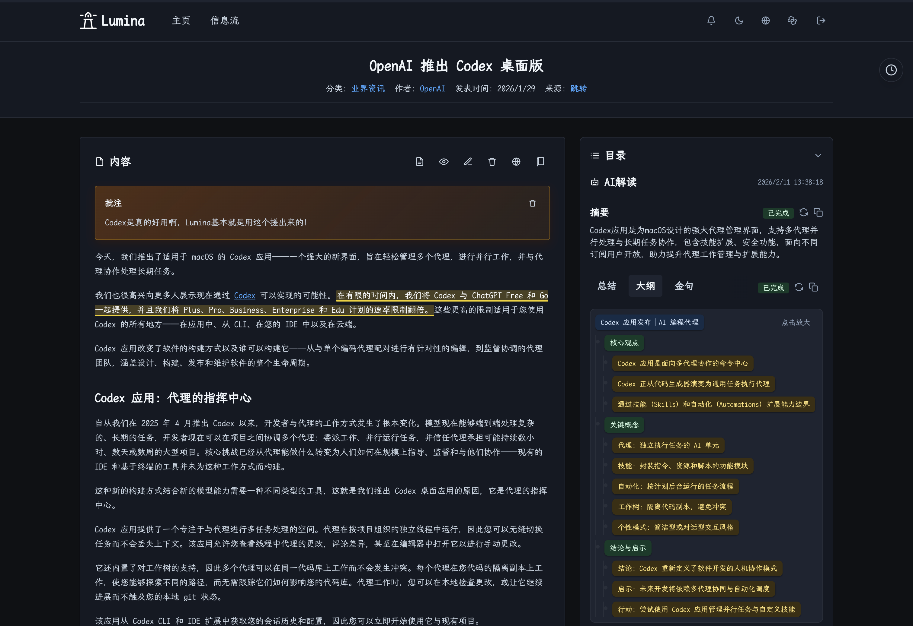

- **最近阅读记录**：显示最近阅读的 5 篇内容，方便快速跳转。

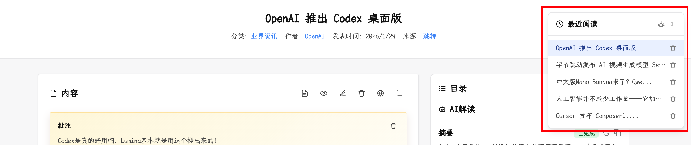

- **文章评论**：支持在详情页对文章进行评论，方便交流与反馈。

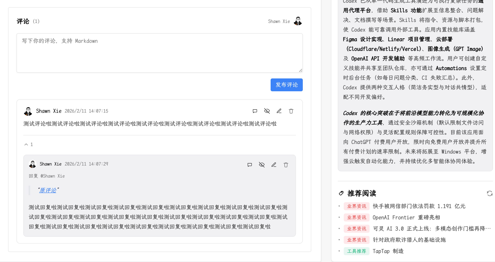

- **内容导出**：支持按分类导出文章标题、头图和摘要，也支持将当前文章或专栏详情页直接导出为 Markdown。

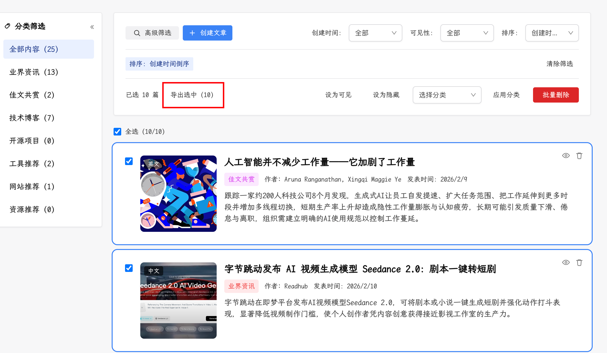

- **专栏工作台**：内置已发布专栏页、辅助起草、文章/主题/内容引用插入，以及专栏评论能力。

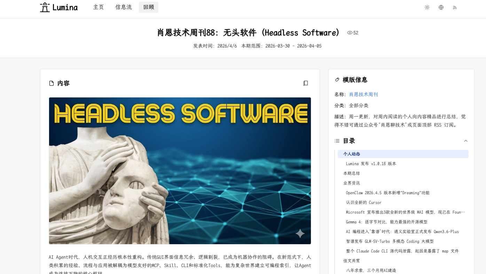

- **RSS 订阅**：支持文章与专栏公开 RSS；文章 RSS 可按分类过滤。

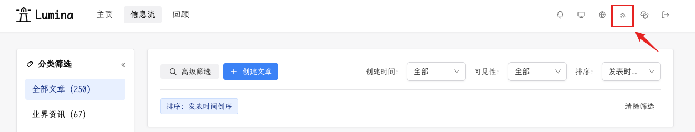

- **通知中心**：在页面头部统一查看 AI 任务链失败与接口错误通知。

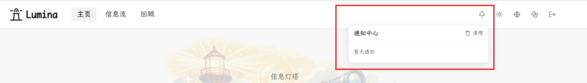

- **备份运维**：后台存储页支持发起“最新备份”后台任务、轮询生成状态，并在完成后直接下载备份压缩包。

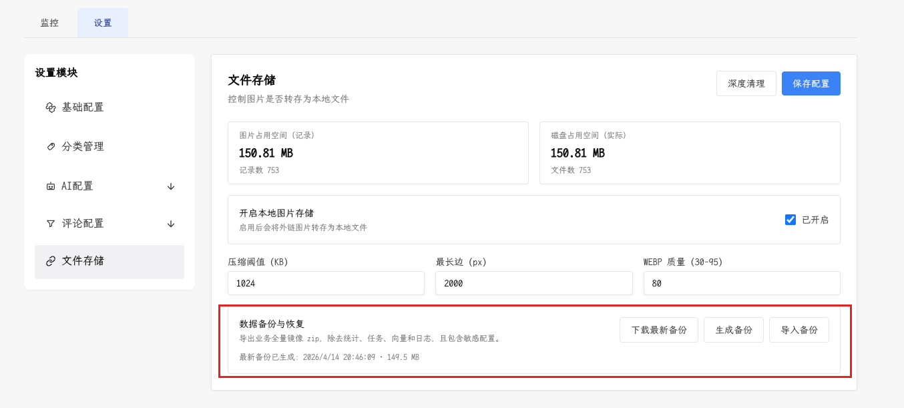

更多功能迭代中...

## 快速开始

```bash
docker compose up -d
./scripts/docker_healthcheck.sh
```

访问地址：

- Web：<http://localhost:3000>
- API（接口）：<http://localhost:8000/backend>
- API（文档）：<http://localhost:8000/docs>

## 生产部署说明

- Docker Compose 文件已包含针对 `/backend/` 的 API 健康检查。
- `./scripts/docker_watchdog.sh` 可通过 cron 或 systemd 定时执行，在 API 探针无响应时重启 API 服务。
- 生产环境建议由 nginx 直接服务 `/backend/media/`，不要让媒体文件流量经过 FastAPI。配置示例见 `deploy/nginx/lumina.conf.example`。

## 最小开发说明

```bash
# Frontend
cd frontend
npm install
npm run dev

# Backend
cd backend
uv sync
uv run uvicorn main:app --reload

# Extension
cd extension
npm install
npm run dev
```

## 常见问题

### API 为什么启动失败？

后端启动校验要求 `INTERNAL_API_TOKEN` 必填，请在环境变量或 Docker 配置中设置。

### 为什么无法登录后台？

首次使用需要先访问 `/login` 设置管理员密码，之后再正常登录。

### 为什么前端请求接口返回 404（如 `/api/articles`）？

后端接口仅在 `/backend/api/*` 下提供（无前缀 `/api/*` 不再可用）。

优先检查 `API_BASE_URL`。同源环境通常应为 `/backend`；本地前后端分端口时可设置为 `http://localhost:8000/backend`。

### 扩展为什么无法提交文章？

请检查扩展中的 API 地址配置，并确认浏览器可以访问后端接口。

### 为什么主题是空的？

主题解析默认关闭。请在管理后台 **主题解析** 中开启，安装并运行本机 CLI + Bridge + 知识编译器后执行同步。公开主题页目前只展示编译出的 **实体** 与 **概念**。

## 许可证

MIT License
