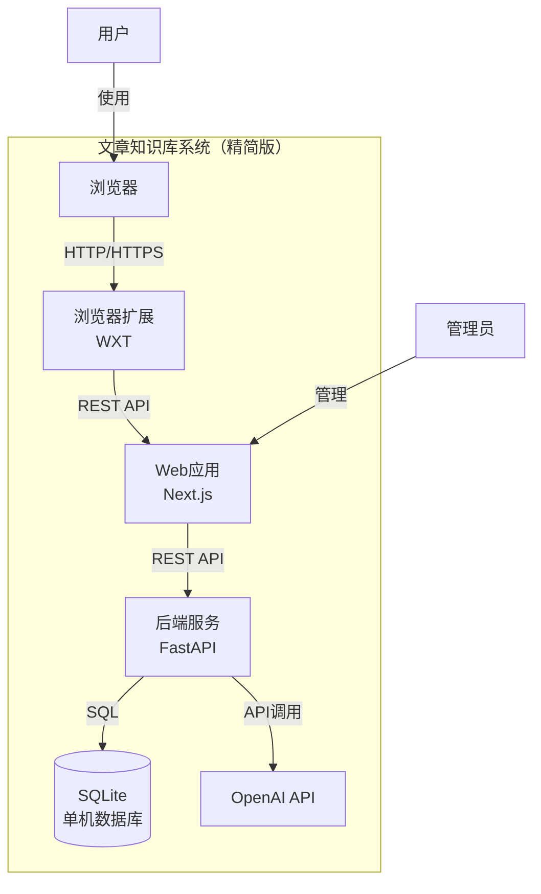
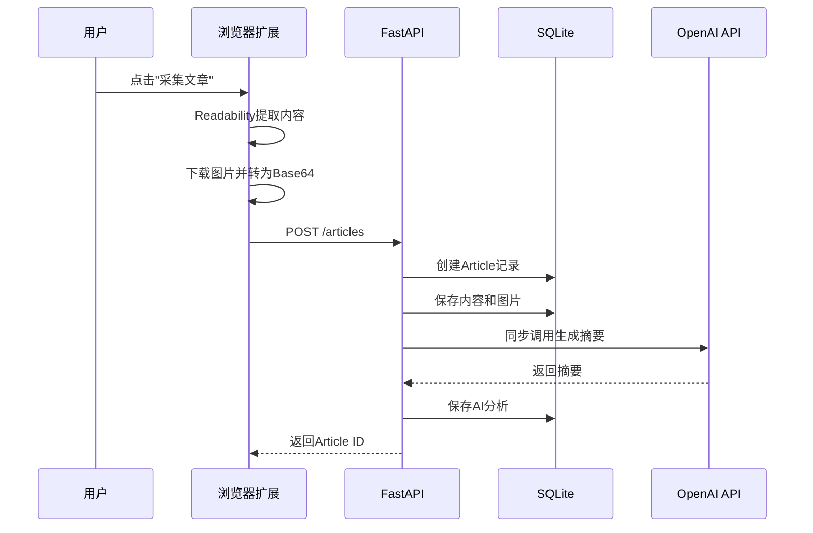

# 文章知识库系统 - 精简版技术方案

## 1. 精简版设计目标

### 1.1 核心原则
- **最小化依赖**：只保留核心功能必需的技术栈
- **快速部署**：单机即可运行，无需复杂配置
- **易于维护**：代码简洁，技术栈熟悉
- **成本最低**：初期零成本，后续按需扩展

### 1.2 功能范围（MVP）
- ✅ 浏览器扩展采集文章
- ✅ 文章列表和详情展示
- ✅ AI摘要生成（单维度）
- ✅ 基础分类管理
- ✅ 文章导出功能
- ❌ 暂不实现：多维度AI解析、复杂筛选、实时通知、监控告警

## 2. 精简技术栈对比

### 2.1 当前方案 vs 精简方案

| 组件 | 当前方案 | 精简方案 | 简化原因 |
|------|----------|----------|----------|
| **前端框架** | Next.js (SSR) | Next.js (CSR) | 简化部署，无需服务端渲染 |
| **UI组件库** | shadcn/ui | 简单CSS + Tailwind | 减少依赖，快速开发 |
| **思维导图** | Markmap | 暂不实现 | 非核心功能，后续添加 |
| **后端框架** | FastAPI + Celery | FastAPI | AI任务同步处理，无需队列 |
| **任务队列** | Redis + Celery | 无 | 初期量小，同步处理即可 |
| **缓存** | Redis | 无 | 初期量小，无需缓存 |
| **ORM** | Prisma | SQLAlchemy | 更成熟，更灵活 |
| **数据库** | PostgreSQL | SQLite | 单机部署更简单 |
| **监控** | Prometheus + Grafana | 无 | 初期不需要 |
| **部署** | Docker Compose (6容器) | Docker Compose (3容器) | 简化架构 |

### 2.2 精简技术栈最终选型

| 层级 | 技术选型 | 版本 | 用途 |
|------|----------|------|------|
| 前端 | Next.js | 14.x | Web应用框架（CSR模式） |
| | React | 18.x | UI库 |
| | Tailwind CSS | 3.x | 样式框架 |
| 浏览器扩展 | WXT | latest | 扩展开发框架 |
| | @mozilla/readability | latest | 正文提取 |
| 后端 | FastAPI | 0.104.x | API框架 |
| | openai | 1.x | OpenAI API客户端 |
| | httpx | 0.25.x | HTTP客户端 |
| 数据库 | SQLite | 3.x | 单机数据库 |
| ORM | SQLAlchemy | 2.x | 数据库ORM |
| 部署 | Docker Compose | latest | 容器编排 |

## 3. 精简架构设计

### 3.1 架构图



### 3.2 核心流程



## 4. 精简数据库设计

### 4.1 数据表结构

```sql
-- 文章表
CREATE TABLE articles (
    id TEXT PRIMARY KEY,
    title TEXT NOT NULL,
    content_html TEXT NOT NULL,
    content_md TEXT,
    content_trans TEXT,
    source_url TEXT UNIQUE NOT NULL,
    top_image BLOB,
    author TEXT,
    published_at TEXT,
    source_domain TEXT,
    status TEXT DEFAULT 'pending',
    category_id TEXT,
    created_at TEXT DEFAULT CURRENT_TIMESTAMP,
    updated_at TEXT DEFAULT CURRENT_TIMESTAMP,
    FOREIGN KEY (category_id) REFERENCES categories(id)
);

-- 分类表
CREATE TABLE categories (
    id TEXT PRIMARY KEY,
    name TEXT UNIQUE NOT NULL,
    description TEXT,
    color TEXT,
    sort_order INTEGER DEFAULT 0,
    created_at TEXT DEFAULT CURRENT_TIMESTAMP
);

-- AI分析表
CREATE TABLE ai_analyses (
    id TEXT PRIMARY KEY,
    article_id TEXT UNIQUE NOT NULL,
    summary TEXT,
    outline TEXT,
    key_points TEXT,
    mindmap TEXT,
    updated_at TEXT DEFAULT CURRENT_TIMESTAMP,
    FOREIGN KEY (article_id) REFERENCES articles(id) ON DELETE CASCADE
);

-- AI配置表
CREATE TABLE ai_configs (
    id TEXT PRIMARY KEY,
    category_id TEXT,
    dimension TEXT NOT NULL,
    is_enabled INTEGER DEFAULT 1,
    model_name TEXT DEFAULT 'gpt-4o',
    prompt_template TEXT,
    parameters TEXT,
    created_at TEXT DEFAULT CURRENT_TIMESTAMP,
    updated_at TEXT DEFAULT CURRENT_TIMESTAMP,
    UNIQUE(category_id, dimension),
    FOREIGN KEY (category_id) REFERENCES categories(id) ON DELETE CASCADE
);

-- 导出配置表
CREATE TABLE export_configs (
    id TEXT PRIMARY KEY,
    name TEXT NOT NULL,
    field_selection TEXT NOT NULL,
    filter_config TEXT NOT NULL,
    created_at TEXT DEFAULT CURRENT_TIMESTAMP
);

-- 索引
CREATE INDEX idx_articles_category ON articles(category_id);
CREATE INDEX idx_articles_status ON articles(status);
CREATE INDEX idx_articles_created_at ON articles(created_at DESC);
CREATE INDEX idx_articles_source_url ON articles(source_url);
CREATE INDEX ai_analyses_article_id ON ai_analyses(article_id);
CREATE INDEX ai_configs_category ON ai_configs(category_id);
CREATE INDEX ai_configs_dimension ON ai_configs(dimension);
```

### 4.2 SQLAlchemy模型

```python
# models.py
from sqlalchemy import Column, String, Text, Integer, Boolean, ForeignKey, create_engine
from sqlalchemy.ext.declarative import declarative_base
from sqlalchemy.orm import relationship
import uuid

Base = declarative_base()

def generate_uuid():
    return str(uuid.uuid4())

class Category(Base):
    __tablename__ = 'categories'
    
    id = Column(String, primary_key=True, default=generate_uuid)
    name = Column(String, unique=True, nullable=False)
    description = Column(Text)
    color = Column(String)
    sort_order = Column(Integer, default=0)
    created_at = Column(String, default=lambda: datetime.utcnow().isoformat())
    
    articles = relationship("Article", back_populates="category")
    ai_configs = relationship("AIConfig", back_populates="category")

class Article(Base):
    __tablename__ = 'articles'
    
    id = Column(String, primary_key=True, default=generate_uuid)
    title = Column(String, nullable=False)
    content_html = Column(Text, nullable=False)
    content_md = Column(Text)
    content_trans = Column(Text)
    source_url = Column(String, unique=True, nullable=False)
    top_image = Column(String)  # Base64编码
    author = Column(String)
    published_at = Column(String)
    source_domain = Column(String)
    status = Column(String, default='pending')
    category_id = Column(String, ForeignKey('categories.id'))
    created_at = Column(String, default=lambda: datetime.utcnow().isoformat())
    updated_at = Column(String, default=lambda: datetime.utcnow().isoformat())
    
    category = relationship("Category", back_populates="articles")
    ai_analysis = relationship("AIAnalysis", back_populates="article", uselist=False)

class AIAnalysis(Base):
    __tablename__ = 'ai_analyses'
    
    id = Column(String, primary_key=True, default=generate_uuid)
    article_id = Column(String, ForeignKey('articles.id', ondelete='CASCADE'), unique=True, nullable=False)
    summary = Column(Text)
    outline = Column(Text)  # JSON字符串
    key_points = Column(Text)  # JSON字符串
    mindmap = Column(Text)
    updated_at = Column(String, default=lambda: datetime.utcnow().isoformat())
    
    article = relationship("Article", back_populates="ai_analysis")

class AIConfig(Base):
    __tablename__ = 'ai_configs'
    
    id = Column(String, primary_key=True, default=generate_uuid)
    category_id = Column(String, ForeignKey('categories.id', ondelete='CASCADE'))
    dimension = Column(String, nullable=False)
    is_enabled = Column(Boolean, default=True)
    model_name = Column(String, default='gpt-4o')
    prompt_template = Column(Text)
    parameters = Column(Text)  # JSON字符串
    created_at = Column(String, default=lambda: datetime.utcnow().isoformat())
    updated_at = Column(String, default=lambda: datetime.utcnow().isoformat())
    
    category = relationship("Category", back_populates="ai_configs")
```

## 5. 精简AI集成

### 5.1 极简AI客户端

```python
# ai/client.py
from openai import OpenAI
import os

class SimpleAIClient:
    """极简AI客户端"""
    
    def __init__(self):
        self.client = OpenAI(api_key=os.getenv('OPENAI_API_KEY'))
    
    def generate_summary(self, content: str, prompt: str = None) -> str:
        """生成摘要"""
        if not prompt:
            prompt = f"请为以下文章生成一个简洁的摘要（100-200字）：\n\n{content}"
        
        response = self.client.chat.completions.create(
            model="gpt-4o",
            messages=[{"role": "user", "content": prompt}],
            max_tokens=500,
            temperature=0.7
        )
        return response.choices[0].message.content
```

### 5.2 同步处理AI任务

```python
# services/article_service.py
from ai.client import SimpleAIClient
from models import Article, AIAnalysis, db_session

class ArticleService:
    def __init__(self):
        self.ai_client = SimpleAIClient()
    
    def create_article(self, article_data: dict) -> str:
        """创建文章并同步生成AI摘要"""
        # 保存文章
        article = Article(**article_data)
        db_session.add(article)
        db_session.commit()
        
        # 同步生成AI摘要
        try:
            summary = self.ai_client.generate_summary(article.content_md)
            
            # 保存AI分析
            ai_analysis = AIAnalysis(
                article_id=article.id,
                summary=summary
            )
            db_session.add(ai_analysis)
            db_session.commit()
            
            # 更新文章状态
            article.status = 'completed'
            db_session.commit()
        except Exception as e:
            print(f"AI生成失败: {e}")
            article.status = 'failed'
            db_session.commit()
        
        return article.id
```

## 6. 精简API设计

### 6.1 核心接口

```python
# main.py
from fastapi import FastAPI, HTTPException
from pydantic import BaseModel
from services.article_service import ArticleService
from models import Article, Category, db_session

app = FastAPI(title="文章知识库API", version="1.0.0")
article_service = ArticleService()

class ArticleCreate(BaseModel):
    title: str
    content_html: str
    content_md: str
    source_url: str
    top_image: str
    author: str
    category_id: str

class ArticleResponse(BaseModel):
    id: str
    title: str
    summary: str
    top_image: str
    category: dict
    author: str
    status: str
    created_at: str

@app.post("/api/articles", response_model=dict)
async def create_article(article: ArticleCreate):
    """创建文章"""
    article_id = article_service.create_article(article.dict())
    return {"id": article_id, "status": "processing"}

@app.get("/api/articles", response_model=list[ArticleResponse])
async def get_articles(
    page: int = 1,
    size: int = 20,
    category_id: str = None,
    search: str = None
):
    """获取文章列表"""
    query = db_session.query(Article)
    
    if category_id:
        query = query.filter(Article.category_id == category_id)
    if search:
        query = query.filter(Article.title.contains(search))
    
    query = query.order_by(Article.created_at.desc())
    query = query.offset((page - 1) * size).limit(size)
    
    articles = query.all()
    return [
        {
            "id": a.id,
            "title": a.title,
            "summary": a.ai_analysis.summary if a.ai_analysis else "",
            "top_image": a.top_image,
            "category": {"id": a.category.id, "name": a.category.name} if a.category else None,
            "author": a.author,
            "status": a.status,
            "created_at": a.created_at
        }
        for a in articles
    ]

@app.get("/api/articles/{article_id}")
async def get_article(article_id: str):
    """获取文章详情"""
    article = db_session.query(Article).filter(Article.id == article_id).first()
    if not article:
        raise HTTPException(status_code=404, detail="文章不存在")
    
    return {
        "id": article.id,
        "title": article.title,
        "content_html": article.content_html,
        "content_md": article.content_md,
        "content_trans": article.content_trans,
        "source_url": article.source_url,
        "top_image": article.top_image,
        "category": {"id": article.category.id, "name": article.category.name} if article.category else None,
        "author": article.author,
        "status": article.status,
        "created_at": article.created_at,
        "ai_analysis": {
            "summary": article.ai_analysis.summary if article.ai_analysis else None
        } if article.ai_analysis else None
    }

@app.get("/api/categories")
async def get_categories():
    """获取分类列表"""
    categories = db_session.query(Category).order_by(Category.sort_order).all()
    return [
        {
            "id": c.id,
            "name": c.name,
            "description": c.description,
            "color": c.color,
            "article_count": len(c.articles)
        }
        for c in categories
    ]

@app.post("/api/categories")
async def create_category(data: dict):
    """创建分类"""
    category = Category(**data)
    db_session.add(category)
    db_session.commit()
    return {"id": category.id, "name": category.name}

@app.delete("/api/categories/{category_id}")
async def delete_category(category_id: str):
    """删除分类"""
    category = db_session.query(Category).filter(Category.id == category_id).first()
    if not category:
        raise HTTPException(status_code=404, detail="分类不存在")
    
    db_session.delete(category)
    db_session.commit()
    return {"message": "删除成功"}

@app.post("/api/export")
async def export_articles(data: dict):
    """导出文章"""
    article_ids = data.get("article_ids", [])
    articles = db_session.query(Article).filter(Article.id.in_(article_ids)).all()
    
    markdown_content = ""
    for article in articles:
        markdown_content += f"# {article.title}\n\n"
        markdown_content += f"**作者**: {article.author}\n\n"
        markdown_content += f"**来源**: {article.source_url}\n\n"
        if article.ai_analysis:
            markdown_content += f"**摘要**: {article.ai_analysis.summary}\n\n"
        markdown_content += article.content_md + "\n\n---\n\n"
    
    return {"content": markdown_content, "filename": "articles_export.md"}
```

## 7. 精简部署配置

### 7.1 Docker Compose配置

```yaml
version: '3.8'

services:
  # 前端应用
  web:
    build: ./frontend
    ports:
      - "3000:3000"
    environment:
      - NEXT_PUBLIC_API_URL=http://localhost:8000
    depends_on:
      - api

  # 后端API
  api:
    build: ./backend
    ports:
      - "8000:8000"
    environment:
      - DATABASE_URL=sqlite:///./data/articles.db
      - OPENAI_API_KEY=${OPENAI_API_KEY}
    volumes:
      - ./data:/app/data
    depends_on:
      - web

volumes:
  data:
```

### 7.2 后端Dockerfile

```dockerfile
# backend/Dockerfile
FROM python:3.11-slim

WORKDIR /app

COPY requirements.txt .
RUN pip install --no-cache-dir -r requirements.txt

COPY . .

CMD ["uvicorn", "main:app", "--host", "0.0.0.0", "--port", "8000"]
```

### 7.3 前端Dockerfile

```dockerfile
# frontend/Dockerfile
FROM node:18-alpine

WORKDIR /app

COPY package*.json ./
RUN npm install

COPY . .
RUN npm run build

EXPOSE 3000

CMD ["npm", "start"]
```

### 7.4 requirements.txt

```txt
fastapi==0.104.1
uvicorn==0.24.0
sqlalchemy==2.0.23
openai==1.3.7
httpx==0.25.2
python-multipart==0.0.6
pydantic==2.5.0
```

## 8. 快速启动指南

### 8.1 环境准备

```bash
# 1. 克隆项目
git clone <repository-url>
cd article-database

# 2. 配置环境变量
cp .env.example .env
# 编辑.env文件，设置OPENAI_API_KEY

# 3. 启动服务
docker-compose up -d

# 4. 访问应用
# 前端: http://localhost:3000
# 后端API: http://localhost:8000
# API文档: http://localhost:8000/docs
```

### 8.2 本地开发

```bash
# 后端开发
cd backend
python -m venv venv
source venv/bin/activate
pip install -r requirements.txt
uvicorn main:app --reload

# 前端开发
cd frontend
npm install
npm run dev
```

## 9. 成本分析

### 9.1 运营成本（月度）

| 项目 | 规格 | 单价 | 数量 | 小计 |
|------|------|------|------|------|
| 云服务器 | 2核4G | ¥100/月 | 1台 | ¥100 |
| OpenAI API | - | - | - | ¥100-500 |
| 域名+SSL | - | - | - | ¥50 |
| **总计** | - | - | - | **¥250-650/月** |

### 9.2 成本对比

| 版本 | 月度成本 | 节省 |
|------|----------|------|
| 原方案 | ¥1250-2750 | - |
| 精简方案 | ¥250-650 | **80%** |

## 10. 扩展路径

### 10.1 后续可添加功能

1. **多维度AI解析**：添加大纲、关键信息、思维导图
2. **异步任务队列**：引入Redis + Celery处理大量AI任务
3. **缓存优化**：添加Redis缓存提升性能
4. **数据库升级**：从SQLite迁移到PostgreSQL
5. **监控告警**：添加Prometheus + Grafana
6. **用户认证**：添加JWT认证和权限管理
7. **实时通知**：添加WebSocket实时更新

### 10.2 技术栈升级路径

| 当前 | 升级后 | 触发条件 |
|------|----------|----------|
| SQLite | PostgreSQL | 数据量>10万条 |
| 同步AI | Celery异步 | AI任务>100/天 |
| 无缓存 | Redis缓存 | QPS>50 |
| 简单UI | shadcn/ui | UI需求复杂 |
| 无监控 | Prometheus+Grafana | 生产环境 |

## 11. 总结

### 11.1 精简方案优势

1. **零成本启动**：初期只需OpenAI API费用
2. **快速部署**：3个容器，5分钟启动
3. **易于维护**：技术栈简单，代码量少
4. **灵活扩展**：模块化设计，按需升级
5. **学习成本低**：使用主流技术栈，易于上手

### 11.2 适用场景

- ✅ 个人使用或小团队（<100用户）
- ✅ 文章量<1万篇
- ✅ AI处理量<100次/天
- ✅ 快速验证业务价值
- ❌ 不适合：高并发、大数据量、企业级应用

### 11.3 实施建议

1. **第一阶段（1-2周）**：实现精简版MVP
2. **第二阶段（2-4周）**：根据使用情况优化
3. **第三阶段（按需）**：根据业务增长逐步升级

---

**文档版本：** v3.0 (精简版)  
**最后更新：** 2024-01-18  
**更新内容：** 生成最精简的可自部署实现版本
