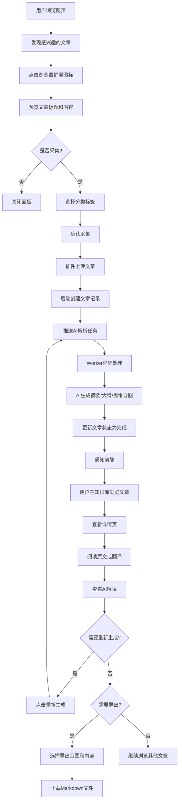
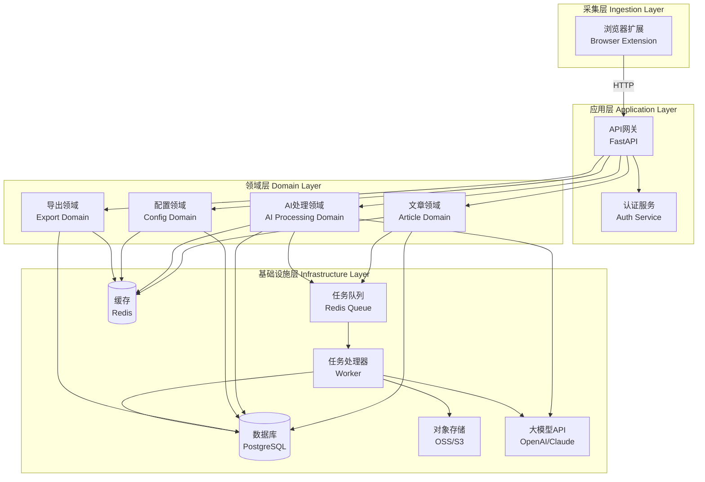
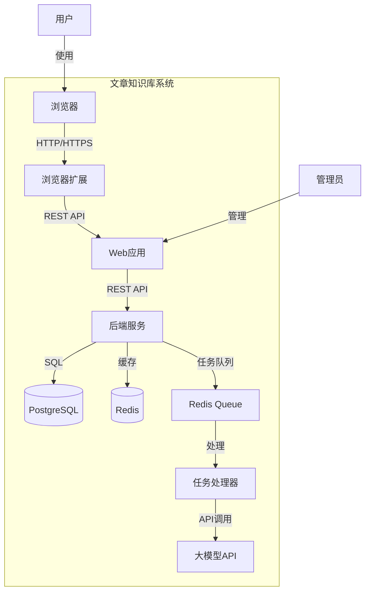
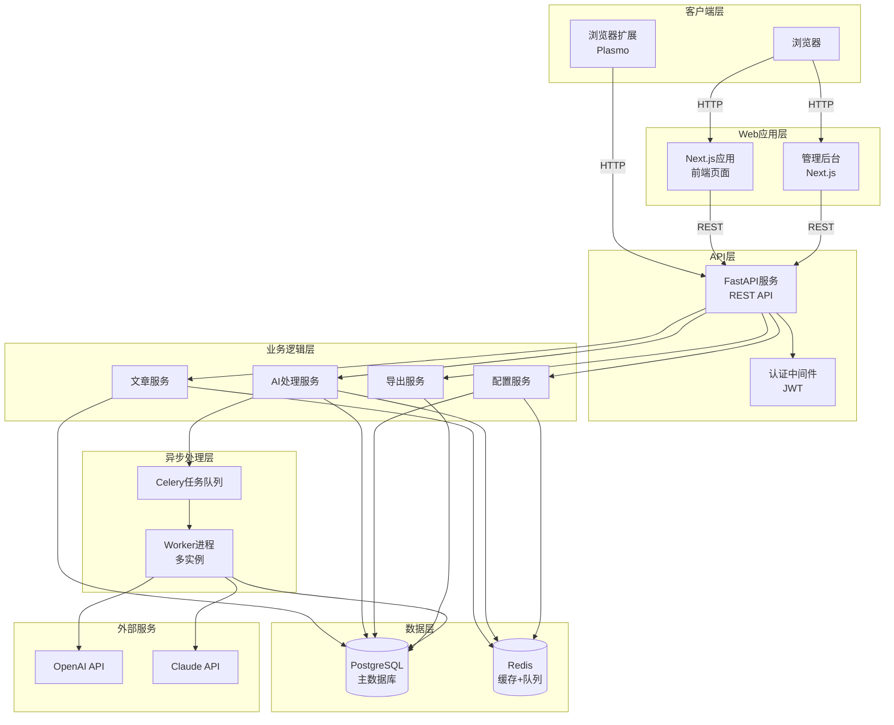
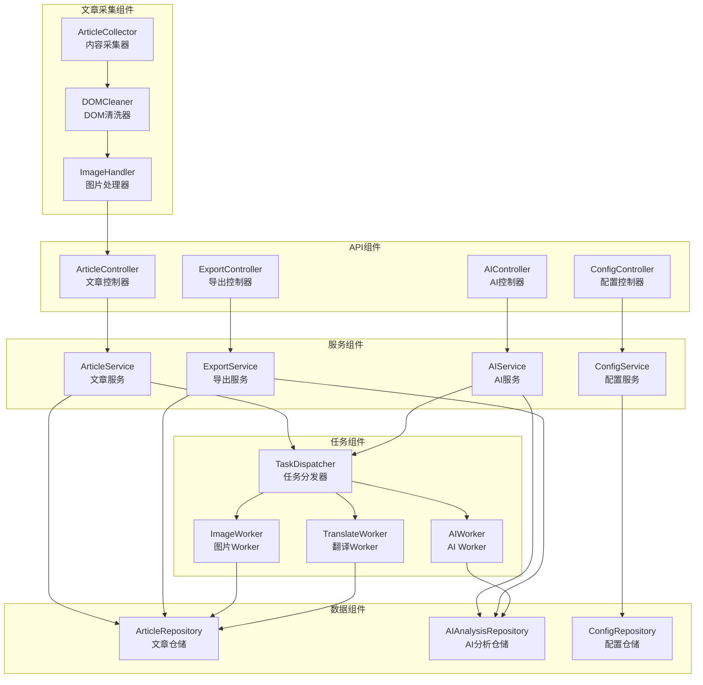
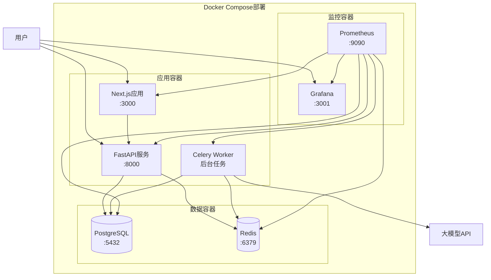
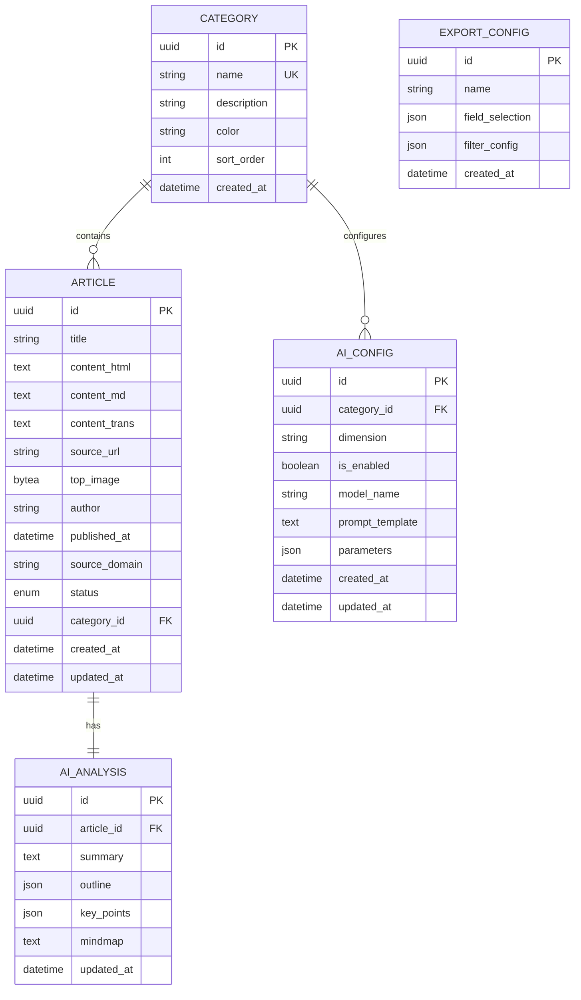
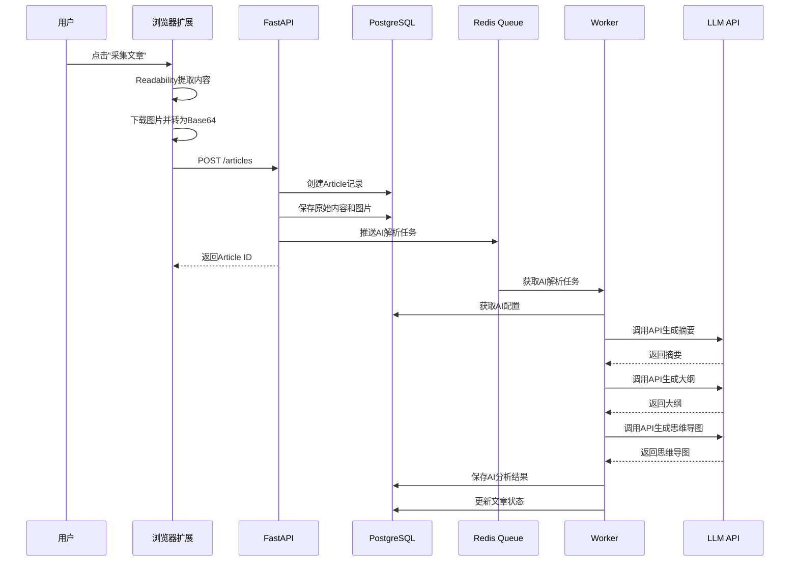
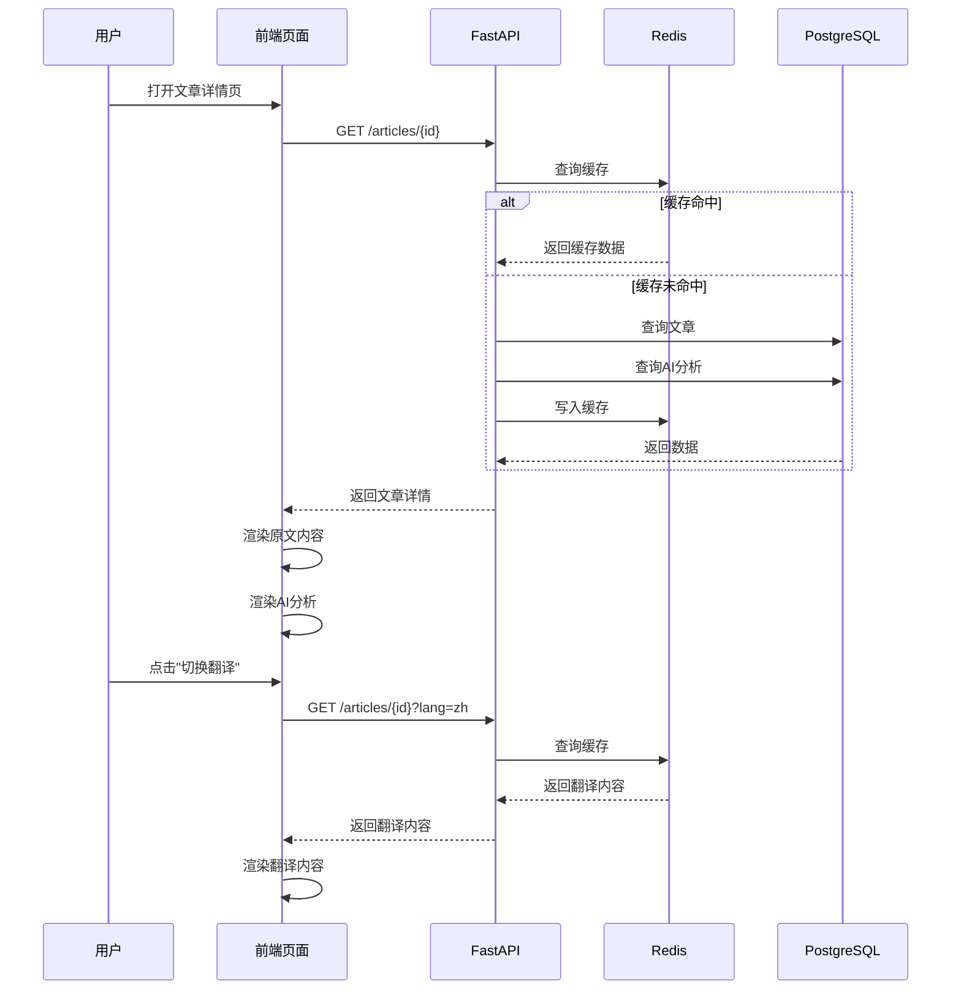
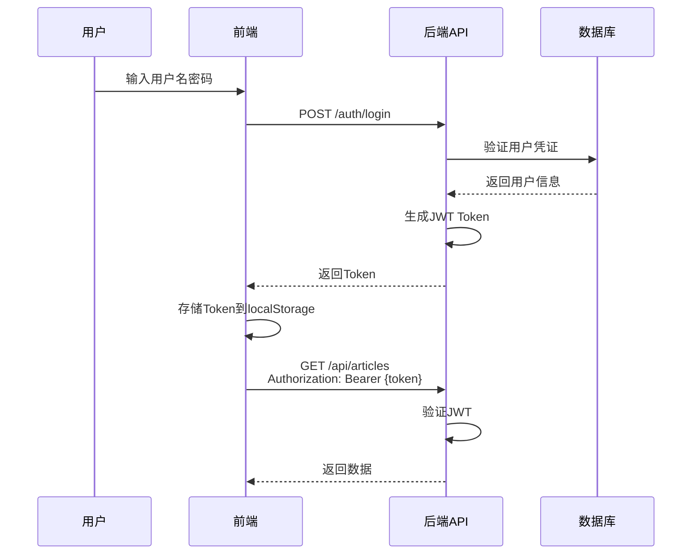

# 文章知识库系统 - TRD（优化版）

## 1. 需求澄清记录

### 1.1 业务目标确认

| 问题 | 回答 | 备注 |
|------|------|------|
| 核心业务价值是什么？ | 帮助用户高效采集、整理、理解和管理网络文章，通过AI增强阅读体验 | 个人知识管理场景 |
| 目标用户是谁？ | 知识工作者、研究人员、内容创作者 | B2C个人用户 |
| 预期用户规模？ | 初期100-500用户，中期1000-5000用户 | 影响架构选型 |
| 核心使用场景？ | 浏览网页时一键采集、在知识库中浏览和回顾文章、导出整理好的内容 | 采集→管理→导出闭环 |
| 内容来源类型？ | 主要是技术博客、新闻网站、学术文章等网页内容 | 需考虑反爬虫策略 |

### 1.2 质量属性需求

| 属性 | 指标 | 优先级 | 验证方式 |
|------|------|--------|----------|
| 可用性 | 99.5% | 高 | 监控告警 |
| 响应时间 | 列表页<500ms，详情页<800ms | 高 | 性能测试 |
| 并发能力 | 支持100 QPS | 中 | 压力测试 |
| 数据一致性 | 文章与AI分析强一致 | 高 | 事务保证 |
| 可扩展性 | 支持横向扩展Worker | 中 | 架构设计 |
| 安全性 | API认证、数据加密 | 高 | 安全审计 |

### 1.3 业务事件→系统责任映射表

| 业务事件 | 触发者 | 系统责任 | 输出 |
|----------|--------|----------|------|
| 用户点击采集文章 | 浏览器插件 | 提取页面内容、上传至后端、创建AI任务 | Article ID |
| AI任务执行完成 | Worker | 更新文章状态、保存AI分析结果、通知前端 | 更新后的文章数据 |
| 用户浏览文章列表 | 前端页面 | 分页查询、过滤排序、返回文章摘要 | 文章列表数据 |
| 用户查看文章详情 | 前端页面 | 获取完整文章、AI分析、翻译内容 | 文章详情数据 |
| 用户切换原文/翻译 | 前端页面 | 返回对应语言版本的内容 | 原文或翻译内容 |
| 用户重新生成AI内容 | 前端页面 | 创建新的AI任务、更新状态 | 任务ID |
| 管理员配置AI策略 | 管理后台 | 保存/更新AI配置 | 配置确认 |
| 管理员管理分类 | 管理后台 | CRUD分类标签 | 分类数据 |
| 用户批量导出文章 | 前端页面 | 查询文章、组装Markdown、返回文件 | Markdown文件 |
| 图片转储完成 | Worker | 更新文章HTML中的图片URL | 更新后的文章 |

## 2. 产品形态与交互流程设计

### 2.1 产品形态决策

**决策：Web应用 + 浏览器扩展的组合方案**

| 方案 | 优势 | 劣势 | 决策 |
|------|------|------|------|
| 纯Web应用 | 无需安装，跨平台 | 采集体验差，需手动复制URL | ❌ |
| 浏览器扩展 | 采集体验好，可深度操作DOM | 需安装，受浏览器限制 | ✅ 采集端 |
| 移动App | 移动体验好 | 开发成本高，采集不便 | ❌ |
| 桌面客户端 | 功能强大 | 部署复杂，跨平台困难 | ❌ |

### 2.2 关键界面原型图

#### 2.2.1 浏览器扩展面板

```
┌─────────────────────────────────┐
│  📚 文章采集器              [×]  │
├─────────────────────────────────┤
│                                 │
│  标题预览:                       │
│  ┌───────────────────────────┐  │
│  │ 深入理解React Server      │  │
│  │ Components               │  │
│  └───────────────────────────┘  │
│                                 │
│  分类: [技术博客 ▼]             │
│                                 │
│  状态: ⏳ 上传中...              │
│                                 │
│  [取消]  [确定采集]              │
│                                 │
└─────────────────────────────────┘
```

#### 2.2.2 文章列表页（双栏布局）

```
┌─────────────────────────────────────────────────────────┐
│ 📚 文章知识库              [搜索框]  [筛选▼]  [导出]    │
├─────────────────────────────────────────────────────────┤
│                                                         │
│  ┌──────────────────┐  ┌──────────────────────────┐   │
│  │  🏷️ 分类筛选      │  │  文章列表                 │   │
│  │                  │  │                          │   │
│  │  ☑ 技术博客      │  │  ┌────────────────────┐  │   │
│  │  ☐ 新闻资讯      │  │  │ [头图] 深入理解... │  │   │
│  │  ☐ 学术文章      │  │  │ 作者: John Doe    │  │   │
│  │  ☐ 其他          │  │  │ 分类: 技术博客    │  │   │
│  │                  │  │  │ 时间: 2024-01-15  │  │   │
│  │  📅 时间筛选      │  │  │ 摘要: 本文详细... │  │   │
│  │  [最近7天 ▼]     │  │  │                  │  │   │
│  │                  │  │  │ [查看详情] [删除] │  │   │
│  └──────────────────┘  │  └────────────────────┘  │   │
│                        │                          │   │
│                        │  ┌────────────────────┐  │   │
│                        │  │ [头图] Next.js...  │  │   │
│                        │  │ 作者: Jane Smith  │  │   │
│                        │  │ 分类: 技术博客    │  │   │
│                        │  │ ...               │  │   │
│                        │  └────────────────────┘  │   │
│                        │                          │   │
│                        │  [加载更多]              │   │
│                        └──────────────────────────┘   │
│                                                         │
│                    [1] [2] [3] ... [>]                  │
└─────────────────────────────────────────────────────────┘
```

#### 2.2.3 文章详情页（左右分栏）

```
┌─────────────────────────────────────────────────────────────────┐
│ ← 返回列表    深入理解React Server Components    [🔄 重新生成]  │
├──────────────────────────────┬──────────────────────────────────┤
│  📄 原文内容                 │  🤖 AI 解读                     │
│                              │                                  │
│  [🇺🇸 原文] [🇨🇳 翻译]      │  ┌──────────────────────────┐ │
│                              │  │ 📝 摘要                   │ │
│  ┌────────────────────────┐ │  │ 本文详细介绍了RSC的...    │ │
│  │ 深入理解React Server   │ │  └──────────────────────────┘ │
│  │ Components             │ │                                  │
│  │                        │ │  ┌──────────────────────────┐ │
│  │ 作者: John Doe         │ │  │ 📑 大纲                   │ │
│  │ 分类: 技术博客         │ │  │ 1. 什么是RSC            │ │
│  │ 时间: 2024-01-15       │ │  │ 2. 核心特性              │ │
│  │                        │ │  │ 3. 使用场景              │ │
│  │ [正文内容...]          │ │  └──────────────────────────┘ │
│  │                        │ │                                  │
│  │ React Server           │ │  ┌──────────────────────────┐ │
│  │ Components (RSC) 是... │ │  │ 🔑 关键信息               │ │
│  │                        │ │  │ • 服务端渲染              │ │
│  │ [继续阅读...]          │ │  │ • 零客户端JS             │ │
│  └────────────────────────┘ │  │ • SEO友好                │ │
│                              │  └──────────────────────────┘ │
│                              │                                  │
│                              │  ┌──────────────────────────┐ │
│                              │  │ 🧠 思维导图               │ │
│                              │  │  [思维导图可视化区域]    │ │
│                              │  └──────────────────────────┘ │
└──────────────────────────────┴──────────────────────────────────┘
```

#### 2.2.4 管理后台页面

```
┌─────────────────────────────────────────────────────────┐
│ ⚙️ 管理后台              [仪表板] [标签] [AI配置] [导出] │
├─────────────────────────────────────────────────────────┤
│                                                         │
│  📊 仪表板                                               │
│  ┌──────────┬──────────┬──────────┬──────────┐        │
│  │ 文章总数  │ 今日新增  │ AI处理中  │ 处理失败  │        │
│  │   1,234  │    45    │    12    │     3    │        │
│  └──────────┴──────────┴──────────┴──────────┘        │
│                                                         │
│  🏷️ 标签管理                                             │
│  ┌─────────────────────────────────────────────────┐   │
│  │ [+ 新增标签]                                      │   │
│  │                                                  │   │
│  │ 名称          | 文章数 | 操作                    │   │
│  │ 技术博客       |  856   | [编辑] [删除]          │   │
│  │ 新闻资讯       |  234   | [编辑] [删除]          │   │
│  │ 学术文章       |  144   | [编辑] [删除]          │   │
│  └─────────────────────────────────────────────────┘   │
│                                                         │
│  🤖 AI 配置                                              │
│  ┌─────────────────────────────────────────────────┐   │
│  │ 全局配置                                          │   │
│  │ 模型: [gpt-4o ▼]  API Key: [••••••••]           │   │
│  │                                                  │   │
│  │ 分类配置                                          │   │
│  │ 技术博客:                                        │   │
│  │   ☑ 摘要  ☑ 大纲  ☑ 关键信息  ☑ 思维导图        │   │
│  │   模型: [gpt-4o ▼]                          │   │
│  │   Prompt模板: [编辑...]                          │   │
│  └─────────────────────────────────────────────────┘   │
└─────────────────────────────────────────────────────────┘
```

### 2.3 用户旅程流程图



## 3. 模块划分与依赖关系

### 3.1 限界上下文划分



### 3.2 模块职责表

| 模块 | 职责 | 核心实体 | 对外接口 |
|------|------|----------|----------|
| 浏览器扩展 | 页面内容提取、图片处理、与后端通信 | ArticleCollector | collectArticle() |
| API网关 | 请求路由、认证授权、限流 | - | REST API |
| 文章领域 | 文章CRUD、状态管理、分类关联 | Article, Category | /articles, /categories |
| AI处理领域 | AI任务调度、结果存储、重试机制 | AIAnalysis, AITask | /articles/{id}/retry |
| 配置领域 | AI策略配置、分类管理 | AIConfig, Category | /configs/ai, /categories |
| 导出领域 | 批量查询、Markdown组装、文件生成 | ExportConfig | /export |
| 任务处理器 | 异步任务执行、图片转储、AI调用 | Worker | - |

### 3.3 依赖矩阵

| ↓ 依赖 → | 浏览器扩展 | API网关 | 文章领域 | AI处理领域 | 配置领域 | 导出领域 | 任务处理器 |
|----------|------------|--------|----------|------------|----------|----------|------------|
| 浏览器扩展 | - | ✓ | - | - | - | - | - |
| API网关 | - | - | ✓ | ✓ | ✓ | ✓ | - |
| 文章领域 | - | - | - | - | ✓ | - | - |
| AI处理领域 | - | - | ✓ | - | ✓ | - | - |
| 配置领域 | - | - | - | - | - | - | - |
| 导出领域 | - | - | ✓ | ✓ | - | - | - |
| 任务处理器 | - | - | ✓ | - | ✓ | - | - |

## 4. 技术栈选型与决策

### 4.1 技术栈对比表

| 技术领域 | 候选方案 | 优势 | 劣势 | 决策 | 理由 |
|----------|----------|------|------|------|------|
| **前端框架** | Next.js (React) | SSR/SSG支持、SEO友好、生态成熟 | 学习曲线 | ✅ | 符合需求，团队熟悉 |
| | Vue 3 + Nuxt | 渐进式、中文文档好 | 生态略小 | ❌ | 团队React经验更多 |
| | SvelteKit | 轻量、高性能 | 生态较小 | ❌ | 风险较高 |
| **后端框架** | FastAPI | 高性能、自动文档、类型安全 | 异步生态较新 | ✅ | Python生态好，AI集成方便 |
| | Django | 功能全、ORM强大 | 较重、性能一般 | ❌ | 过度设计 |
| | Node.js (Express) | 全栈统一 | 异步复杂度高 | ❌ | Python更适合AI |
| **数据库** | PostgreSQL | 功能强大、JSON支持、可靠性 | 配置复杂 | ✅ | 关系型+JSONB灵活 |
| | MySQL | 流行、简单 | JSON支持弱 | ❌ | 不如PG灵活 |
| | MongoDB | 文档型、灵活 | 事务支持弱 | ❌ | 关系数据重要 |
| **ORM** | Prisma | 类型安全、自动迁移 | 性能略低 | ✅ | 开发效率高 |
| | SQLAlchemy | 成熟、灵活 | 手写迁移 | ❌ | 开发效率低 |
| **缓存/队列** | Redis | 高性能、数据结构丰富 | 内存成本 | ✅ | 标准方案 |
| | RabbitMQ | 功能强大、可靠 | 复杂、重 | ❌ | 过度设计 |
| **任务队列** | Celery | 成熟、功能全 | 重、依赖多 | ✅ | Python生态 |
| | RQ | 轻量、简单 | 功能较少 | ❌ | 功能不足 |
| **浏览器扩展** | Plasmo | React支持、开发体验好 | 新项目 | ✅ | 与Next.js统一 |
| | Vanilla JS | 无依赖 | 开发效率低 | ❌ | 维护成本高 |
| **AI集成** | LangChain | 功能全、抽象好 | 过度设计 | ✅ | 灵活性好 |
| | 直接调用API | 简单、可控 | 需自己管理 | ❌ | 缺少抽象 |
| **思维导图** | Markmap | Markdown转SVG、轻量 | 功能单一 | ✅ | 满足需求 |
| | D3.js | 功能强大 | 复杂、学习成本高 | ❌ | 过度设计 |
| **图片存储** | 数据库存储 | 成本低、简单可靠 | 存储空间限制 | ✅ | 初期成本低 |
| | OSS (阿里云) | 稳定、CDN加速 | 成本高 | ❌ | 成本较高 |
| | S3 (AWS) | 生态好 | 国内访问慢 | ❌ | 网络问题 |

### 4.2 技术栈最终选型

| 层级 | 技术选型 | 版本 | 用途 |
|------|----------|------|------|
| 前端 | Next.js | 14.x | Web应用框架 |
| | React | 18.x | UI库 |
| | Tailwind CSS | 3.x | 样式框架 |
| | shadcn/ui | latest | UI组件库 |
| | Markmap | latest | 思维导图渲染 |
| 浏览器扩展 | Plasmo | latest | 扩展开发框架 |
| | @mozilla/readability | latest | 正文提取 |
| 后端 | FastAPI | 0.104.x | API框架 |
| | Celery | 5.x | 任务队列 |
| | LangChain | 0.1.x | AI集成 |
| | httpx | 0.25.x | HTTP客户端 |
| 数据库 | PostgreSQL | 15.x | 主数据库 |
| | Redis | 7.x | 缓存+队列 |
| ORM | Prisma | 5.x | 数据库ORM |
| 存储 | PostgreSQL | 15.x | 图片存储（BYTEA） |
| 部署 | Docker Compose | latest | 容器编排 |

### 4.3 技术风险评估

| 风险项 | 风险等级 | 影响 | 缓解措施 |
|--------|----------|------|----------|
| LLM API限流 | 中 | AI处理延迟 | 实现重试机制、多模型备选 |
| 数据库存储空间 | 中 | 存储空间不足 | 定期清理、监控空间使用 |
| 浏览器扩展权限 | 低 | 功能受限 | 提前测试、用户引导 |
| 并发性能 | 中 | 响应慢 | 缓存优化、数据库索引 |
| 成本控制 | 中 | LLM调用成本高 | 监控用量、设置预算告警 |

## 5. 架构设计

### 5.1 C4 Context图



### 5.2 C4 Container图



### 5.3 核心组件图



### 5.4 部署架构图



#### 5.4.1 Docker Compose配置示例

```yaml
version: '3.8'

services:
  # 前端应用
  web:
    build: ./frontend
    ports:
      - "3000:3000"
    environment:
      - NEXT_PUBLIC_API_URL=http://localhost:8000
    depends_on:
      - api

  # 后端API
  api:
    build: ./backend
    ports:
      - "8000:8000"
    environment:
      - DATABASE_URL=postgresql://user:password@db:5432/article_db
      - REDIS_URL=redis://redis:6379
      - JWT_SECRET=your-secret-key
    depends_on:
      - db
      - redis

  # Celery Worker
  worker:
    build: ./backend
    command: celery -A app.worker worker --loglevel=info
    environment:
      - DATABASE_URL=postgresql://user:password@db:5432/article_db
      - REDIS_URL=redis://redis:6379
    depends_on:
      - db
      - redis

  # PostgreSQL数据库
  db:
    image: postgres:15-alpine
    ports:
      - "5432:5432"
    environment:
      - POSTGRES_USER=user
      - POSTGRES_PASSWORD=password
      - POSTGRES_DB=article_db
    volumes:
      - postgres_data:/var/lib/postgresql/data

  # Redis缓存
  redis:
    image: redis:7-alpine
    ports:
      - "6379:6379"
    volumes:
      - redis_data:/data

  # Prometheus监控
  prometheus:
    image: prom/prometheus:latest
    ports:
      - "9090:9090"
    volumes:
      - ./prometheus.yml:/etc/prometheus/prometheus.yml
      - prometheus_data:/prometheus

  # Grafana可视化
  grafana:
    image: grafana/grafana:latest
    ports:
      - "3001:3000"
    environment:
      - GF_SECURITY_ADMIN_PASSWORD=admin
    volumes:
      - grafana_data:/var/lib/grafana

volumes:
  postgres_data:
  redis_data:
  prometheus_data:
  grafana_data:
```

### 5.5 数据库ER图



### 5.6 核心时序图

#### 5.6.1 文章采集时序图



#### 5.6.2 文章查看时序图



## 6. 接口契约设计

### 6.1 RESTful API规范

| 规范项 | 说明 |
|--------|------|
| 基础URL | `/api/v1` |
| 认证方式 | JWT Bearer Token |
| 响应格式 | JSON |
| 错误码 | HTTP状态码 + 业务错误码 |
| 分页 | `?page=1&size=20` |
| 排序 | `?sort=-created_at` |
| 过滤 | `?category=xxx&status=xxx` |

### 6.2 核心接口定义

#### 6.2.1 文章接口

**创建文章**
```http
POST /api/v1/articles
Content-Type: application/json
Authorization: Bearer {token}

{
  "title": "文章标题",
  "content_html": "<div>HTML内容</div>",
  "content_md": "# Markdown内容",
  "source_url": "https://example.com/article",
  "top_image": "https://example.com/image.jpg",
  "category_id": "uuid",
  "author": "作者名",
  "published_at": "2024-01-15T10:00:00Z"
}

Response 201:
{
  "id": "uuid",
  "status": "processing",
  "created_at": "2024-01-15T10:00:00Z"
}
```

**获取文章列表**
```http
GET /api/v1/articles?page=1&size=20&category_id=xxx&created_at_start=2024-01-01&created_at_end=2024-01-31&published_at_start=2024-01-01&published_at_end=2024-01-31&source_domain=example.com&author=John&search=keyword&sort=-created_at
Authorization: Bearer {token}

查询参数说明:
- page: 页码，默认1
- size: 每页数量，默认20
- category_id: 分类ID筛选
- created_at_start: 存储时间开始（插件同步时间）
- created_at_end: 存储时间结束
- published_at_start: 文章发布时间开始
- published_at_end: 文章发布时间结束
- source_domain: 来源域名筛选
- author: 作者筛选
- search: 关键词搜索（标题、摘要）
- sort: 排序字段，默认-created_at（同步时间倒序）

Response 200:
{
  "data": [
    {
      "id": "uuid",
      "title": "文章标题",
      "summary": "摘要内容",
      "top_image": "data:image/jpeg;base64,...",
      "category": {
        "id": "uuid",
        "name": "技术博客"
      },
      "author": "作者名",
      "source_domain": "example.com",
      "published_at": "2024-01-15T10:00:00Z",
      "status": "completed",
      "created_at": "2024-01-15T10:00:00Z"
    }
  ],
  "pagination": {
    "page": 1,
    "size": 20,
    "total": 100,
    "total_pages": 5
  }
}
```

**获取文章详情**
```http
GET /api/v1/articles/{id}?lang=zh
Authorization: Bearer {token}

Response 200:
{
  "id": "uuid",
  "title": "文章标题",
  "content_html": "<div>HTML内容</div>",
  "content_md": "# Markdown内容",
  "content_trans": "# 翻译内容",
  "source_url": "https://example.com/article",
  "top_image": "https://example.com/image.jpg",
  "category": {
    "id": "uuid",
    "name": "技术博客"
  },
  "author": "作者名",
  "status": "completed",
  "created_at": "2024-01-15T10:00:00Z",
  "ai_analysis": {
    "summary": "AI生成的摘要",
    "outline": {
      "sections": [
        {"level": 1, "title": "第一章"},
        {"level": 2, "title": "1.1 小节"}
      ]
    },
    "key_points": ["关键点1", "关键点2"],
    "mindmap": "# 思维导图\n- 分支1\n  - 子分支"
  }
}
```

**删除文章**
```http
DELETE /api/v1/articles/{id}
Authorization: Bearer {token}

Response 204
```

**重新生成AI内容**
```http
POST /api/v1/articles/{id}/retry
Content-Type: application/json
Authorization: Bearer {token}

{
  "ai_types": ["summary", "outline", "mindmap"]
}

Response 202:
{
  "task_id": "uuid",
  "status": "pending"
}
```

#### 6.2.2 分类接口

**创建分类**
```http
POST /api/v1/categories
Content-Type: application/json
Authorization: Bearer {token}

{
  "name": "技术博客",
  "description": "技术类文章",
  "color": "#3B82F6",
  "sort_order": 1
}

Response 201:
{
  "id": "uuid",
  "name": "技术博客",
  "description": "技术类文章",
  "color": "#3B82F6",
  "sort_order": 1,
  "article_count": 0
}
```

**获取分类列表**
```http
GET /api/v1/categories
Authorization: Bearer {token}

Response 200:
{
  "data": [
    {
      "id": "uuid",
      "name": "技术博客",
      "description": "技术类文章",
      "color": "#3B82F6",
      "sort_order": 1,
      "article_count": 856
    }
  ]
}
```

#### 6.2.3 AI配置接口

**获取AI配置**
```http
GET /api/v1/configs/ai?category_id=xxx
Authorization: Bearer {token}

查询参数说明:
- category_id: 分类ID，不传则返回全局配置

Response 200:
{
  "global": {
    "api_key": "sk-***",
    "dimensions": {
      "summary": {
        "is_enabled": true,
        "model_name": "gpt-4o",
        "prompt_template": "请为以下文章生成摘要...",
        "parameters": {
          "temperature": 0.7,
          "max_tokens": 500
        }
      },
      "outline": {
        "is_enabled": true,
        "model_name": "gpt-4o",
        "prompt_template": "请为以下文章生成大纲...",
        "parameters": {
          "temperature": 0.5,
          "max_tokens": 1000
        }
      },
      "key_points": {
        "is_enabled": true,
        "model_name": "gpt-3.5-turbo",
        "prompt_template": "请提取以下文章的关键信息...",
        "parameters": {
          "temperature": 0.3,
          "max_tokens": 300
        }
      },
      "mindmap": {
        "is_enabled": true,
        "model_name": "gpt-4o",
        "prompt_template": "请为以下文章生成思维导图（Markdown格式）...",
        "parameters": {
          "temperature": 0.5,
          "max_tokens": 1500
        }
      }
    }
  },
  "categories": [
    {
      "category_id": "uuid",
      "category_name": "技术博客",
      "dimensions": {
        "summary": {
          "is_enabled": true,
          "model_name": "gpt-4o",
          "prompt_template": "请为技术类文章生成摘要...",
          "parameters": {
            "temperature": 0.7,
            "max_tokens": 500
          }
        },
        "outline": {
          "is_enabled": true,
          "model_name": "gpt-4o",
          "prompt_template": "请为技术类文章生成大纲...",
          "parameters": {
            "temperature": 0.5,
            "max_tokens": 1000
          }
        },
        "key_points": {
          "is_enabled": false,
          "model_name": "gpt-3.5-turbo",
          "prompt_template": "请提取技术类文章的关键信息...",
          "parameters": {
            "temperature": 0.3,
            "max_tokens": 300
          }
        },
        "mindmap": {
          "is_enabled": true,
          "model_name": "gpt-4o",
          "prompt_template": "请为技术类文章生成思维导图...",
          "parameters": {
            "temperature": 0.5,
            "max_tokens": 1500
          }
        }
      }
    }
  ]
}
```

**更新AI配置**
```http
PUT /api/v1/configs/ai
Content-Type: application/json
Authorization: Bearer {token}

{
  "global": {
    "api_key": "sk-new-key"
  },
  "categories": [
    {
      "category_id": "uuid",
      "dimensions": {
        "summary": {
          "is_enabled": true,
          "model_name": "gpt-4o",
          "prompt_template": "请为技术类文章生成摘要...",
          "parameters": {
            "temperature": 0.7,
            "max_tokens": 500
          }
        },
        "outline": {
          "is_enabled": true,
          "model_name": "gpt-4o",
          "prompt_template": "请为技术类文章生成大纲...",
          "parameters": {
            "temperature": 0.5,
            "max_tokens": 1000
          }
        },
        "key_points": {
          "is_enabled": false,
          "model_name": "gpt-3.5-turbo",
          "prompt_template": "请提取技术类文章的关键信息...",
          "parameters": {
            "temperature": 0.3,
            "max_tokens": 300
          }
        },
        "mindmap": {
          "is_enabled": true,
          "model_name": "gpt-4o",
          "prompt_template": "请为技术类文章生成思维导图...",
          "parameters": {
            "temperature": 0.5,
            "max_tokens": 1500
          }
        }
      }
    }
  ]
}

Response 200
```

#### 6.2.4 导出接口

**批量导出**
```http
POST /api/v1/export
Content-Type: application/json
Authorization: Bearer {token}

{
  "article_ids": ["uuid1", "uuid2"],
  "filters": {
    "category_id": "uuid",
    "date_range": {
      "start": "2024-01-01",
      "end": "2024-01-31"
    }
  },
  "fields": {
    "include_title": true,
    "include_image": true,
    "include_summary": true,
    "include_outline": true,
    "include_key_points": true,
    "include_mindmap": false
  },
  "format": "markdown"
}

Response 200:
{
  "download_url": "https://oss.example.com/export/xxx.md",
  "filename": "articles_export_20240115.md"
}
```

### 6.3 WebSocket接口

**实时更新推送**
```javascript
// 客户端连接
const ws = new WebSocket('wss://api.example.com/ws/articles/{article_id}');

// 服务端推送
{
  "type": "ai_update",
  "data": {
    "article_id": "uuid",
    "status": "completed",
    "ai_analysis": {
      "summary": "AI生成的摘要"
    }
  }
}
```

### 6.4 错误码规范

| 错误码 | HTTP状态 | 说明 |
|--------|----------|------|
| 1001 | 400 | 请求参数错误 |
| 1002 | 401 | 未认证 |
| 1003 | 403 | 无权限 |
| 1004 | 404 | 资源不存在 |
| 1005 | 409 | 资源冲突 |
| 2001 | 429 | 请求过于频繁 |
| 3001 | 500 | 服务器内部错误 |
| 3002 | 503 | 服务不可用 |
| 4001 | 502 | AI服务调用失败 |
| 4002 | 504 | AI服务超时 |

## 7. 性能指标与扩展性设计

### 7.1 性能指标

| 指标 | 目标值 | 测量方式 | 告警阈值 |
|------|--------|----------|----------|
| API响应时间 (P50) | <200ms | APM监控 | >300ms |
| API响应时间 (P95) | <500ms | APM监控 | >800ms |
| API响应时间 (P99) | <1000ms | APM监控 | >2000ms |
| 数据库查询时间 | <100ms | 慢查询日志 | >200ms |
| 缓存命中率 | >80% | Redis监控 | <70% |
| AI任务处理时间 | <30s | 任务队列监控 | >60s |
| 并发用户数 | 100 | 负载测试 | - |
| QPS | 100 | 压力测试 | >150 |
| 系统可用性 | 99.5% | 监控统计 | <99% |

### 7.2 扩展性设计

#### 7.2.1 水平扩展策略

| 组件 | 扩展方式 | 扩展难度 | 备注 |
|------|----------|----------|------|
| Next.js应用 | 多实例部署 | 低 | 无状态，支持横向扩展 |
| FastAPI应用 | 多实例部署 | 低 | 无状态，支持横向扩展 |
| Worker进程 | 增加Worker数量 | 低 | 基于队列自动扩展 |
| PostgreSQL | 主从复制 | 中 | 读写分离 |
| Redis | 主从复制+集群 | 中 | 数据分片 |

#### 7.2.2 自动扩展配置

```yaml
# Kubernetes HPA示例
apiVersion: autoscaling/v2
kind: HorizontalPodAutoscaler
metadata:
  name: fastapi-hpa
spec:
  scaleTargetRef:
    apiVersion: apps/v1
    kind: Deployment
    name: fastapi
  minReplicas: 2
  maxReplicas: 10
  metrics:
  - type: Resource
    resource:
      name: cpu
      target:
        type: Utilization
        averageUtilization: 70
  - type: Resource
    resource:
      name: memory
      target:
        type: Utilization
        averageUtilization: 80
```

### 7.3 缓存策略

| 缓存类型 | 缓存键 | 过期时间 | 更新策略 |
|----------|--------|----------|----------|
| 文章详情 | `article:{id}` | 1小时 | 主动失效 |
| 文章列表 | `articles:list:{hash}` | 5分钟 | 主动失效 |
| AI分析 | `ai_analysis:{id}` | 24小时 | 主动失效 |
| 分类列表 | `categories:all` | 1小时 | 定时刷新 |
| AI配置 | `ai_config:{category_id}` | 1小时 | 配置更新时失效 |

### 7.4 数据库优化

#### 7.4.1 索引策略

```sql
-- 文章表索引
CREATE INDEX idx_articles_category ON articles(category_id);
CREATE INDEX idx_articles_status ON articles(status);
CREATE INDEX idx_articles_created_at ON articles(created_at DESC);
CREATE INDEX idx_articles_source_url ON articles(source_url);
CREATE INDEX idx_articles_fulltext ON articles USING gin(to_tsvector('english', title || ' ' || content_md));

-- AI分析表索引
CREATE INDEX idx_ai_analysis_article_id ON ai_analysis(article_id);

-- 分类表索引
CREATE INDEX idx_categories_name ON categories(name);

-- AI配置表索引
CREATE INDEX idx_ai_config_category ON ai_configs(category_id);
CREATE INDEX idx_ai_config_dimension ON ai_configs(dimension);
```

#### 7.4.2 分表策略

| 表 | 分表键 | 分表策略 | 触发条件 |
|----|--------|----------|----------|
| articles | created_at | 按月分表 | 单表>1000万条 |
| ai_analysis | article_id | 不分表 | 关联查询为主 |
| task_logs | created_at | 按周分表 | 日志表 |

### 7.5 限流策略

| 限流类型 | 限流规则 | 超限处理 |
|----------|----------|----------|
| API请求 | 100 req/min/IP | 返回429 |
| 文章创建 | 10 req/min/user | 返回429 |
| AI调用 | 10 req/min/user | 返回429 |
| 导出请求 | 1 req/min/user | 返回429 |

## 8. 安全设计

### 8.1 认证授权

#### 8.1.1 认证流程



#### 8.1.2 JWT Token结构

```json
{
  "header": {
    "alg": "HS256",
    "typ": "JWT"
  },
  "payload": {
    "user_id": "uuid",
    "username": "admin",
    "role": "admin",
    "exp": 1705334400,
    "iat": 1705248000
  }
}
```

#### 8.1.3 权限模型

| 角色 | 权限 |
|------|------|
| guest | 浏览文章列表、查看文章详情、导出文章 |
| admin | guest权限 + 管理分类、配置AI、删除文章、重新生成AI |

### 8.2 数据安全

#### 8.2.1 敏感数据加密

| 数据类型 | 加密方式 | 存储位置 |
|----------|----------|----------|
| API Key | AES-256 | 数据库（加密字段） |
| 用户密码 | bcrypt | 数据库 |
| JWT Secret | 环境变量 | 配置文件 |

#### 8.2.2 HTTPS配置

```nginx
server {
    listen 443 ssl http2;
    server_name api.example.com;
    
    ssl_certificate /etc/ssl/certs/cert.pem;
    ssl_certificate_key /etc/ssl/private/key.pem;
    ssl_protocols TLSv1.2 TLSv1.3;
    ssl_ciphers HIGH:!aNULL:!MD5;
    
    add_header Strict-Transport-Security "max-age=31536000" always;
}
```

### 8.3 安全防护

| 防护类型 | 实现方式 |
|----------|----------|
| SQL注入 | 参数化查询、ORM |
| XSS攻击 | 输入过滤、输出转义 |
| CSRF攻击 | CSRF Token |
| 限流防刷 | Redis限流器 |
| 文件上传 | 类型检查、大小限制 |
| API滥用 | 速率限制、IP黑名单 |

### 8.4 审计日志

```sql
CREATE TABLE audit_logs (
    id UUID PRIMARY KEY DEFAULT gen_random_uuid(),
    user_id UUID,
    action VARCHAR(50),
    resource_type VARCHAR(50),
    resource_id UUID,
    ip_address INET,
    user_agent TEXT,
    request_data JSONB,
    response_status INTEGER,
    created_at TIMESTAMP DEFAULT NOW()
);

CREATE INDEX idx_audit_logs_user ON audit_logs(user_id);
CREATE INDEX idx_audit_logs_created ON audit_logs(created_at);
```

## 9. 运维与监控

### 9.1 监控体系

#### 9.1.1 监控指标

| 层级 | 监控指标 | 工具 |
|------|----------|------|
| 应用层 | QPS、响应时间、错误率 | Prometheus + Grafana |
| 系统层 | CPU、内存、磁盘、网络 | Node Exporter |
| 数据库层 | 连接数、慢查询、锁等待 | PostgreSQL Exporter |
| 缓存层 | 命中率、内存使用、连接数 | Redis Exporter |
| 业务层 | 文章数、AI任务数、用户数 | 自定义指标 |

#### 9.1.2 告警规则

```yaml
groups:
- name: api_alerts
  rules:
  - alert: HighErrorRate
    expr: rate(http_requests_total{status=~"5.."}[5m]) > 0.05
    for: 5m
    annotations:
      summary: "API错误率过高"
      
  - alert: HighResponseTime
    expr: histogram_quantile(0.95, http_request_duration_seconds) > 1
    for: 5m
    annotations:
      summary: "API响应时间过长"
      
  - alert: DatabaseConnectionHigh
    expr: pg_stat_database_numbackends > 80
    for: 5m
    annotations:
      summary: "数据库连接数过高"
```

### 9.2 日志管理

#### 9.2.1 日志规范

| 日志级别 | 用途 | 示例 |
|----------|------|------|
| ERROR | 错误信息 | 数据库连接失败 |
| WARN | 警告信息 | API调用限流 |
| INFO | 关键操作 | 用户登录、文章创建 |
| DEBUG | 调试信息 | 函数入参、返回值 |

#### 9.2.2 日志格式

```json
{
  "timestamp": "2024-01-15T10:00:00Z",
  "level": "INFO",
  "service": "fastapi",
  "trace_id": "abc123",
  "user_id": "uuid",
  "action": "create_article",
  "message": "Article created successfully",
  "duration_ms": 150
}
```

### 9.3 备份策略

| 数据类型 | 备份频率 | 保留时间 | 备份方式 |
|----------|----------|----------|----------|
| PostgreSQL | 每日 | 30天 | pg_dump + OSS |
| Redis | 每小时 | 7天 | RDB + OSS |
| 配置文件 | 每次变更 | 永久 | Git |
| OSS数据 | 实时 | 90天 | 版本控制 |

### 9.4 灾难恢复

| 场景 | RTO | RPO | 恢复方案 |
|------|-----|-----|----------|
| 应用服务宕机 | 5分钟 | 0 | 自动重启、多实例 |
| 数据库主库宕机 | 15分钟 | <5分钟 | 主从切换 |
| 数据中心故障 | 1小时 | <1小时 | 跨区域备份恢复 |
| 数据误删 | 1小时 | <1小时 | 从备份恢复 |


## 10. 分阶段实施计划

### 10.1 MVP阶段

**目标：** 实现核心功能，验证业务价值

**范围：**
- 浏览器扩展：文章采集、分类选择和进度反馈等功能
- 后端API：文章CRUD、AI解析、分类管理、AI配置、重试机制
- 前端页面：文章列表、详情页
- 数据库：核心表结构

**可交付成果：**
- 可用的浏览器扩展
- 基础Web应用
- AI摘要生成功能

### 10.2 MMF1阶段

**目标：** 增强管理能力，支持批量操作

**范围：**
- 管理后台：完整的配置界面
- 导出功能：批量导出Markdown
- 性能优化：缓存、索引

**可交付成果：**
- 完整的管理后台
- 批量导出功能
- 性能优化完成

### 10.4 完整系统阶段（4周）

**目标：** 生产就绪，支持规模化

**范围：**
- 安全加固：认证授权、审计日志
- 监控告警：完整的监控体系
- 部署优化：容器化、自动扩展
- 文档完善：API文档、运维手册

**可交付成果：**
- 生产环境部署
- 监控告警系统
- 完整文档

## 11. 附录

### 11.1 术语表

| 术语 | 说明 |
|------|------|
| RSC | React Server Components |
| SSR | Server-Side Rendering |
| CSR | Client-Side Rendering |
| JWT | JSON Web Token |
| ORM | Object-Relational Mapping |
| OSS | Object Storage Service |
| QPS | Queries Per Second |
| RTO | Recovery Time Objective |
| RPO | Recovery Point Objective |

### 11.2 参考资源 

| 资源 | 链接 |
|------|------|
| Next.js文档 | https://nextjs.org/docs |
| FastAPI文档 | https://fastapi.tiangolo.com |
| Prisma文档 | https://www.prisma.io/docs |
| Plasmo文档 | https://docs.plasmo.com |
| LangChain文档 | https://python.langchain.com |