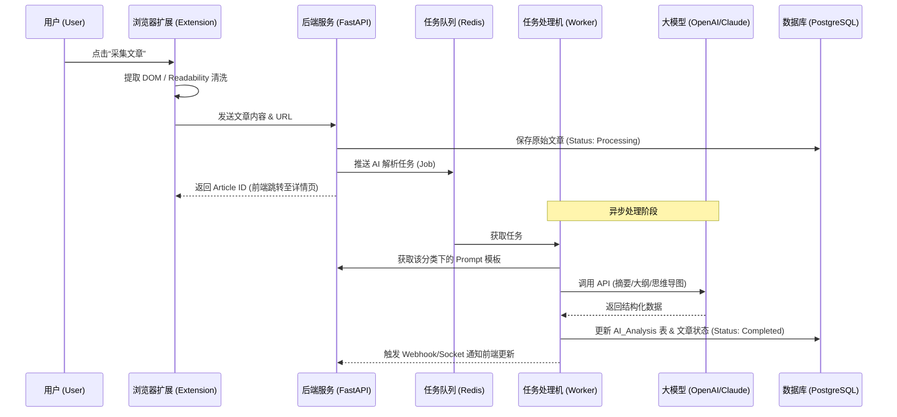

# 文章知识库系统-TRD
##  1. 业务流程
### 1.1 核心交互时序图



## 2. 核心功能模块

| 子系统              | 核心职责                                                         |
| ---------------- | ------------------------------------------------------------ |
| 采集端 (Ingestion)  | 浏览器插件（快捷抓取）/ Web 后台手动输入。负责提取 HTML、清洗 DOM并完成正文提取（Readability） |
| 处理引擎 (Processor) | 图片转储（OSS）、机器翻译、AI 任务调度。                                      |
| 管理后台 (Admin)     | 标签管理、LLM 策略配置（Prompt 模板、模型选择）、导出规则配置。                        |
| 展示端 (Portal)     | 响应式 Web 页面。双栏布局，支持中英切换、思维导图渲染。                               |
## 3. 技术栈选型
- **前端框架**：**Next.js (****React****)**
- **后端服务**： **Python (FastAPI)**
- **数据库**：**PostgreSQL** + **Prisma** **ORM**
- **缓存/队列**：**Redis**
- **核心工具库**：
	- **抓取**：`Puppeteer` 或 `Playwright` (应对动态加载) + `@mozilla/readability` (提取正文)。
    - **AI 调度**：`LangChain` 或直接调用 OpenAI/Claude API。
    - **思维导图渲染**：`Markmap` (支持将 Markdown 直接转为 SVG 思维导图)。
## 4. 数据库设计

### 模型设计

```Java
// schema.prisma 核心片段
model Article {
  id              String       @id @default(uuid())
  title           String
  content_html    String       // 原始/清洗后的HTML
  content_md      String?      // 转换后的Markdown
  content_trans   String?      // 翻译后的正文
  source_url      String       @unique
  top_image       String?
  status          Status       @default(PENDING) // PENDING, PROCESSING, COMPLETED, FAILED
  category        Category?    @relation(fields: [categoryId], references: [id])
  categoryId      String?
  analysis        AIAnalysis?
  createdAt       DateTime     @default(now())
}

model AIAnalysis {
  id              String   @id @default(uuid())
  articleId       String   @unique
  article         Article  @relation(fields: [articleId], references: [id])
  summary         String?
  outline         Json?    // 大纲结构
  key_points      Json?    // 关键词/关键信息
  mindmap         String?  // Markdown格式的思维导图数据
  updatedAt       DateTime @updatedAt
}

model AIConfig {
  id              String   @id @default(uuid())
  category_id     String?  @unique // 若为空则为全局配置
  dimension       String   // SUMMARY, OUTLINE, MAP, KEY_INFO
  is_enabled      Boolean  @default(true)
  model_name      String   @default("gpt-4o")
  prompt_template String
}
```

## 5. 详细实现方案
### 5.1 文章同步插件

核心目标是：**高保真****内容提取、跨域图片预处理、与后端静默同步。**
#### 核心处理流程
- **Readability 解析**：插件注入 `content script`，利用 `@mozilla/readability` 库在本地对 DOM 进行清洗，提取出 `title`, `byline`, `content`, `excerp`。
- **图片处理**：遍历提取出的 HTML，将所有的 `` 标签的 `src` 提取出来，随正文一同发送，或者由后端根据 URL 异步转储。
- **数据打包**：将清洗后的 HTML 转化为标准 Markdown ，通过 `fetch` 调用后端接口。
#### 核心交互流程
- **一键采集**：用户点击插件图标，弹出精简面板。
- **即时预览**：面板展示 Readability 抓取到的标题和头图预览。
- **分类选择**：用户可在面板直接下拉选择“分类标签”（数据由后台接口同步）。
- **进度反馈**：点击确定后，面板显示 `Uploading -> Success`，并提供“跳转至详情页”的链接。
### 5.2 后端服务
#### 5.2.1 接口定义

| 接口                            | 方法              | 功能            | 说明                                 |
| ----------------------------- | --------------- | ------------- | ---------------------------------- |
| /articles                     | POST            | 插件上传文章        | 接收 HTML、URL，触发异步任务                 |
| /articles                     | GET             | 分页列表          | 支持 category, search, time_range 过滤 |
| /articles/{id}                | GET             | 获取详情          | 返回正文、翻译及 AI生成数据                    |
| /articles/{id}                | DELETE          | 删除文章          | 需登录校验                              |
| /articles/{id}/retry/{aiType} | POST            | 重新生成对应类型的AI信息 | 针对单篇触发制定AI类型的解析任务                  |
| /configs/ai                   | GET/PUT         | AI 维度配置       | 设置各维度的 Prompt 和模型参数                |
| /categories                   | GET/POST/DELETE | 分类管理          | 管理标签及其关联的配置                        |
| /export                       | POST            | 批量导出          | 接收 ID 列表和字段勾选项，返回 MD 文件            |
#### 5.2.2 处理引擎
##### 图片转储逻辑
为了解决反盗链，Worker 在接收任务后执行：
1. 使用 `httpx` 下载 `content_html` 中的 `` 链接（伪造 `Referer`）。
2. 流式上传至 OSS或数据库。
3. 替换 `content` 中的 `src` 属性。
##### AI 解析流水线
根据 `AIConfig` 动态组装任务：
1. **翻译任务**：若检测到非中文且开启了翻译，优先执行。
2. **维度****并行**：摘要、大纲、关键信息、思维导图可**并行**调用 LLM。
3. **结构化提取**：
    1. **思维导图**：Prompt 要求 LLM 输出 `markmap` 兼容的 Markdown 层级列表（如 `- 主题 \n - 分支`）。
    2. **大纲**：要求输出标准 JSON。
#### 5.2.3 控制后台
(待完善)
### 5.3 前端页面
#### 5.3.1 主页（列表页）
(待完善)
#### 5.3.2 文章页（详情页）
(待完善)
#### 5.3.3 管理页面
(待完善)